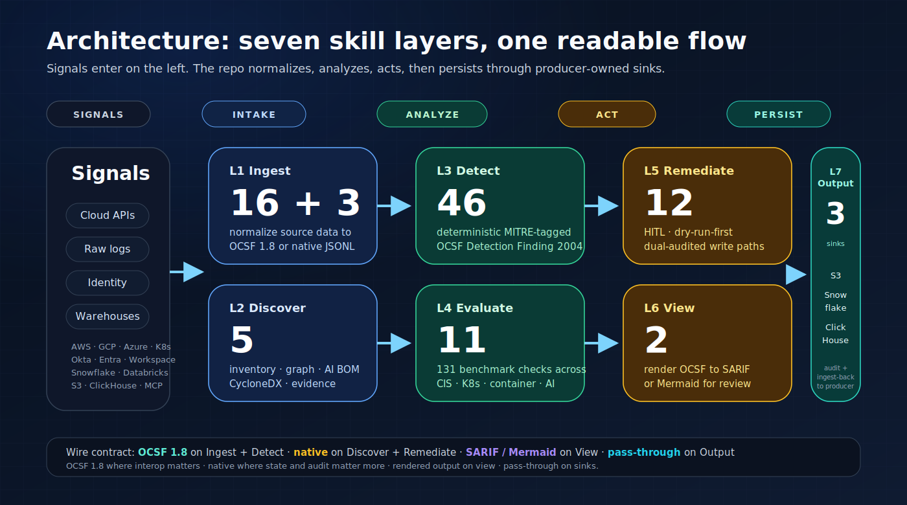

<p align="center">
  <a href="https://github.com/msaad00/cloud-ai-security-skills/actions/workflows/ci.yml?query=branch%3Amain"></a>
  <a href="CHANGELOG.md"></a>
  <a href="LICENSE"></a>
  <a href="https://www.python.org/downloads/"></a>
  <a href="https://schema.ocsf.io/1.8.0"></a>
  <a href="https://attack.mitre.org/"></a>
  <a href="docs/FRAMEWORK_MAPPINGS.md"></a>
  <a href="docs/COVERAGE_SNAPSHOT.md"></a>
  <a href="https://github.com/msaad00/agent-bom"></a>
</p>

<p align="center"><strong>110 production-grade security skills for cloud and AI — OCSF on the wire, MCP-ready, HITL-audited, sandboxed, runs everywhere the same bundle can.</strong></p>

---

## Quickstart

```bash
# 1 · Clone a tagged release
git clone --branch v0.10.0 https://github.com/msaad00/cloud-ai-security-skills.git
cd cloud-ai-security-skills

# 2 · Install only the deps the skills you'll run need
uv sync --group dev --extra aws --extra k8s        # or --extra gcp / --extra azure / ...

# 3 · Run a detection on a captured fixture (no cloud creds needed)
python skills/ingestion/ingest-cloudtrail-ocsf/src/ingest.py \
       skills/detection-engineering/golden/cloudtrail_raw_sample.jsonl \
  | python skills/detection/detect-aws-access-key-creation/src/detect.py \
  | python skills/view/convert-ocsf-to-sarif/src/convert.py \
  > findings.sarif

# 4 · Wire into any agent over MCP — repo-shipped .mcp.json works in Claude Code out of the box.
#     For Claude Desktop, Cursor, Windsurf, Codex, Cortex, Zed: see docs/integrations/.
```

Five surfaces, one bundle: **CLI · CI · MCP · webhook receiver · persistent runners**. Same `SKILL.md + src/ + tests/`, no per-surface drift.

## What this repo gives you

**110 shipped skill bundles** — atomic, deterministic, single-concern. Twelve are guarded write paths; the other 98 are read-only. Drop one into a pipeline, an agent, a Step Function, or a `python ... | python ...` one-liner.

| Layer | Count | Purpose | Output |
|---|---:|---|---|
| **Ingest** | 17 | normalize raw cloud / identity / K8s / MCP / SaaS signal | OCSF 1.8 (native opt-in) |
| **Discover** | 5 | inventory · graph · AI BOM · evidence · IAM-departure planning | native / bridge JSON |
| **Detect** | 57 | deterministic rules tagged with MITRE ATT&CK / ATLAS / OWASP | OCSF Detection Finding 2004 |
| **Evaluate** | 11 | 131 posture and benchmark checks across CIS / NIST / NIST AI RMF / SOC 2 | compliance result |
| **Remediate** | 12 | guarded write paths — IAM departures × 3 clouds, network revoke × 3, session/credential kill × 4, K8s × 2, MCP tool quarantine | audited action trail |
| **View** | 2 | findings → review formats | SARIF · Mermaid |
| **Output** | 3 | append-only sinks | S3 · Snowflake · ClickHouse |
| **Sources** | 3 | warehouse query adapters | S3 Select · Snowflake · Databricks |

**Total: 110 shipped skills.**  Live counts and per-framework coverage in [`docs/COVERAGE_SNAPSHOT.md`](docs/COVERAGE_SNAPSHOT.md) (auto-generated, CI-gated).

**Find a skill:** [`docs/SKILL_INDEX.md`](docs/SKILL_INDEX.md) groups every shipped skill by **environment** (AWS · GCP · Azure/Entra · K8s · Identity · AI/MCP · Web · Cross-env) and by **purpose** (ingest / discover / detect / evaluate / remediate / view / output / source), and points at the framework-mapping docs for control-catalog pivots.

**Which vendor signals normalize to OCSF today?** [`docs/INGEST_COVERAGE.md`](docs/INGEST_COVERAGE.md) — the canonical vendor × source × OCSF class matrix, **18 mappings shipped** (AWS · GCP · Azure · Entra · K8s · Okta · Workspace · MCP · **GitHub · Slack**) plus the 7 documented roadmap rows (Workday, Salesforce, SAP, AWS Config, native ClickHouse audit, AWS web-app exfil pipeline, Workspace beyond-login).

**Why use these skills (vs ad-hoc Python your agent writes at runtime, vs LLM-written skills you commit, vs your team writing 90 from scratch)?** [`docs/WHY.md`](docs/WHY.md) — three different alternatives, three different answers. This repo is built for LLMs and agents to invoke (MCP, Agent SDK, library, CLI, webhook, runners — every surface). What you can't prompt-generate: the trust contract (HITL gates, three-layer sandbox, HMAC-chained audit, allowlist intersection, OCSF wire lock), the calibration values (real-corpus thresholds), the cross-cutting maintenance (OCSF version bumps, MITRE catalog updates, vendor schema drift). Cost framing: ~12 engineer-weeks of harness + ~240 hours of detector content to reach v0.10.0 parity, then the maintenance tax per release.

**Independent security grades.** [`docs/SECURITY_GRADES.md`](docs/SECURITY_GRADES.md) — auto-generated, regenerated weekly by `scripts/regen_security_grades.py`: Bandit (code findings), pip-audit (CVEs), agent-bom (skill trust + provenance), 13 in-repo trust-contract validators. Composite grade visible at the top of the doc.

## Architecture

External signals enter through two intake layers, pass through two analyze layers, exit through two act layers, and persist through one output layer. MCP, CLI, CI, webhook, and runners all invoke the same skill bundle — the surface is transport, not behavior.



The runtime surfaces — CLI, CI, MCP, webhook, library, runners — are documented in the [`Agent integrations`](#agent-integrations) table below; they all import the same skill bundle, so there is no second contract to draw.

More visuals (Mermaid sources under [`docs/diagrams/`](docs/diagrams/), GitHub renders inline):

- [`skill-hierarchy.mmd`](docs/diagrams/skill-hierarchy.mmd) — every shipped layer × every shipped skill, grouped by sub-domain (AWS / GCP / Azure / Identity / K8s / AI-MCP / Web)
- [`surface-comparison.mmd`](docs/diagrams/surface-comparison.mmd) — the six shipped surfaces (CLI · CI · MCP · webhook · library · runners) and the eight trust controls behind every one
- [`pipeline-blast-radius.mmd`](docs/diagrams/pipeline-blast-radius.mmd) — colour-coded by capability so the trust boundary is visible at a glance
- [`mcp-trust-boundary.mmd`](docs/diagrams/mcp-trust-boundary.mmd) — wrapper lifecycle sequence (every guard, every short-circuit branch)
- [`agent-topology.mmd`](docs/diagrams/agent-topology.mmd) — local stdio clients vs remote / HTTP / library / runner

Deeper reads: [`docs/ARCHITECTURE.md`](docs/ARCHITECTURE.md) · [`docs/HARNESS.md`](docs/HARNESS.md) · [`docs/SKILL_CONTRACT.md`](docs/SKILL_CONTRACT.md) · [`docs/SKILL_COMPOSITION.md`](docs/SKILL_COMPOSITION.md)

## Agent integrations

Every agent / IDE goes through the same stdio MCP wrapper. Audit trail, HITL gates, allowlists, RLIMIT enforcement, and timeouts are identical across clients.

| Client | Doc | Transport |
|---|---|---|
| Claude Code (CLI) | repo-root [`.mcp.json`](.mcp.json) — shipped | stdio |
| Claude Desktop | [`docs/integrations/claude-desktop.md`](docs/integrations/claude-desktop.md) | stdio |
| Claude.ai (web) | [`docs/integrations/claude-ai-web.md`](docs/integrations/claude-ai-web.md) | n/a — points at desktop / code |
| Cursor · Windsurf · Codex · Cortex · Zed | [`docs/integrations/`](docs/integrations/) | stdio |
| Continue · Cody · generic MCP client | [`docs/integrations/ide-agents.md`](docs/integrations/ide-agents.md) | stdio |
| Anthropic Agent SDK · OpenAI SDK · LangGraph | [`examples/agents/`](examples/agents/) | stdio + Python harness |
| Webhook (S3 EventBridge / vendor callback / API gateway) | [`runners/webhook-receiver/`](runners/webhook-receiver/) | HTTP, HMAC + bearer |
| Library (any Python app) | [`skills/_shared/library.py`](skills/_shared/library.py) | in-process subprocess |

Pre-canned MCP allowlists for the four shipped use-cases live under [`presets/`](presets/) — CSPM-readonly · detection-only · incident-response · AI-runtime. Workflows under [`examples/workflows/`](examples/workflows/).

## Trust posture

| Layer | What |
|---|---|
| **Audit** | one durable JSONL record per call · HMAC-SHA-256 chain · tamper-evident verifier ([`docs/MCP_AUDIT_CONTRACT.md`](docs/MCP_AUDIT_CONTRACT.md)) |
| **Allowlist** | operator env ∩ caller_context ∩ workflow preset; default-deny on the webhook surface |
| **Read-only by default** | category-derived; AST gate refuses cloud-write calls in read-only skills |
| **Write paths** | dry-run-first · HITL-gated · `min_approvers` enforced before subprocess fires |
| **RLIMIT** | every subprocess capped: 1 GB virtual memory, 100 MB single-file write, CPU = wrapper timeout + grace |
| **Container** | non-root UID 65532 · read-only rootfs · `--cap-drop=ALL` · `no-new-privileges` · default seccomp |
| **Retry** | bounded by construction: ≤ 10 attempts, ≤ 600 s wall-clock budget, no recursive retries ([`skills/_shared/retry.py`](skills/_shared/retry.py)) |
| **No hardcoded secrets** | CI grep, workload identity only |

Read [`SECURITY.md`](SECURITY.md) · [`SECURITY_BAR.md`](SECURITY_BAR.md) · [`docs/THREAT_MODEL.md`](docs/THREAT_MODEL.md) · [`docs/RUNTIME_ISOLATION.md`](docs/RUNTIME_ISOLATION.md).

## Compliance frameworks

OCSF 1.8 · MITRE ATT&CK v14 · MITRE ATLAS · OWASP Top 10 · OWASP LLM Top 10 · OWASP MCP Top 10 · NIST CSF 2.0 · NIST AI RMF 1.0 (GOVERN · MAP · MEASURE · MANAGE) · CIS AWS / GCP / Azure / K8s / Containers / Docker / Controls v8 · SOC 2 TSC · ISO 27001:2022 · PCI DSS 4.0 · CycloneDX ML-BOM.

Live coverage tables (skills × frameworks × clouds × layers): [`docs/COVERAGE_SNAPSHOT.md`](docs/COVERAGE_SNAPSHOT.md). Per-skill mappings: [`docs/FRAMEWORK_MAPPINGS.md`](docs/FRAMEWORK_MAPPINGS.md).

<details>
<summary><b>Why different layers use different formats</b></summary>

OCSF 1.8 is the SIEM interop wire format — valuable exactly where events flow to a downstream analyzer. It is not the universal internal format, and this repo is honest about where it fits:

| Layer | Default | Rationale |
|---|---|---|
| **Ingest** · **Detect** | OCSF 1.8 | SIEMs consume it natively |
| **Evaluate** | native (OCSF 2003 opt-in) | Ops dashboards prefer native; SIEMs opt in |
| **Discover** | native / CycloneDX ML-BOM / bridge | Inventory graphs aren't events |
| **Remediate** | native | A state change with an operator-owned audit trail |
| **View** | OCSF in, SARIF / Mermaid out | The whole point is rendering OCSF for humans |
| **Output (sinks)** | pass-through | Sinks write whatever the producer emitted |

Full discussion: [`docs/ARCHITECTURE.md §3 + §6`](docs/ARCHITECTURE.md). Pinned OCSF contract: [`skills/detection-engineering/OCSF_CONTRACT.md`](skills/detection-engineering/OCSF_CONTRACT.md).

</details>

<details>
<summary><b>Closed-loop coverage</b> — which detections have a paired remediation</summary>

![Closed-loop coverage matrix — 13 of 57 shipped detections are closed loops today; lateral movement is intentionally detection-only, and the AWS access-key, AWS login-profile, AWS discovery-burst, AWS cross-account S3 copy, AWS/GCP/Azure logging-impairment, AWS/GCP model-artifact download, GCP service-account-key creation, GCP service-account-token minting, MCP credential-leak, system-prompt-extraction, tool-output-policy-bypass, tool-output-exfiltration-instructions, Snowflake bulk egress, Snowflake share creation, Snowflake account-key creation, Snowflake warehouse resize burst, Snowflake unauthorized grant, Snowflake failed-MFA burst, Snowflake session-policy bypass, Snowflake network-policy disable, Snowflake replication-config change, ClickHouse bulk export, Databricks token-creation, GitHub PAT creation, GitHub org-secret exposure, and GitHub Actions secret disclosure slices are detection-first today.](docs/images/coverage-matrix.svg)

</details>

## Install · runtime · trust contract

- [`docs/INSTALL.md`](docs/INSTALL.md) — download, verify, install, run
- [`docs/HARNESS.md`](docs/HARNESS.md) — five surfaces · customization knobs · scope boundary · Anthropic alignment
- [`docs/SUPPLY_CHAIN.md`](docs/SUPPLY_CHAIN.md) — SBOM, signing, provenance
- [`docs/CREDENTIAL_PROVENANCE.md`](docs/CREDENTIAL_PROVENANCE.md) — workload identity first
- [`docs/RELEASE_CHECKLIST.md`](docs/RELEASE_CHECKLIST.md) — release gates

## Roadmap

Live: [`docs/COVERAGE_SNAPSHOT.md`](docs/COVERAGE_SNAPSHOT.md) carries the auto-generated framework × cloud × layer coverage. Roadmap tracks live in GitHub Issues — see [`#253`](../../issues/253) (MITRE ATT&CK), [`#254`](../../issues/254) (CIS depth), [`#255`](../../issues/255) (MITRE ATLAS · OWASP LLM · OWASP MCP).

## Integration with agent-bom

This repo ships the security automations. [`agent-bom`](https://github.com/msaad00/agent-bom) provides continuous scanning and a unified graph. Use them together for detection plus response.

## Contributing · License

PRs welcome — read [`CONTRIBUTING.md`](CONTRIBUTING.md) for the skill bar and [`docs/SKILL_CONTRACT.md`](docs/SKILL_CONTRACT.md) for the per-skill checklist. Apache 2.0; coordinated disclosure via [`SECURITY.md`](SECURITY.md).
