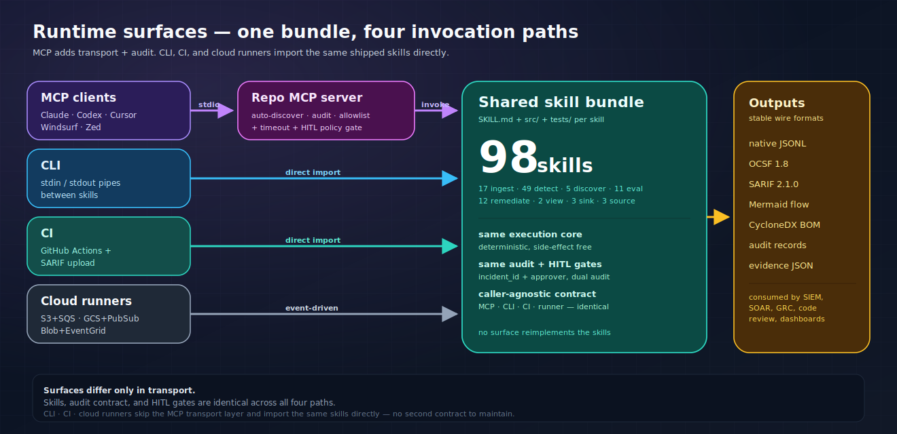
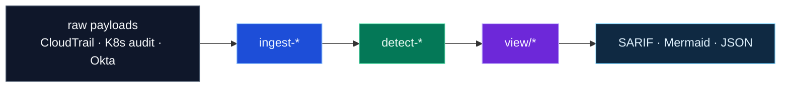
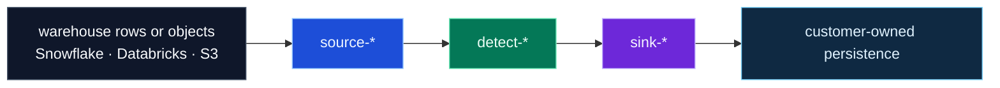

<p align="center">
  <a href="https://github.com/msaad00/cloud-ai-security-skills/actions/workflows/ci.yml?query=branch%3Amain"></a>
  <a href="CHANGELOG.md"></a>
  <a href="LICENSE"></a>
  <a href="https://www.python.org/downloads/"></a>
  <a href="https://schema.ocsf.io/1.8.0"></a>
  <a href="https://attack.mitre.org/"></a>
  <a href="docs/FRAMEWORK_MAPPINGS.md"></a>
  <a href="docs/COVERAGE_MODEL.md"></a>
  <a href="https://github.com/msaad00/agent-bom"></a>
</p>

---

## What this repo gives you

**76 production-grade skill bundles** for cloud and AI security. Each one normalizes raw cloud, identity, Kubernetes, or MCP signal into a standards-aligned finding — OCSF 1.8 on the wire where it matters, native JSONL where state and audit matter more.

Twelve of those skills are **guarded write paths**: IAM departures across AWS, GCP, and Azure Entra; network revoke on AWS, GCP, and Azure; Okta and Workspace session kill; Entra service-principal credential revoke; Kubernetes quarantine and RBAC revoke; MCP tool quarantine. Every write is dry-run-first, HITL-gated, and dual-audited.

The skill contract is the same everywhere: one `SKILL.md` + `src/` + `tests/` bundle that runs unchanged from the **CLI**, from **CI**, behind an **MCP** wrapper for any agentic client, or inside a **persistent cloud runner**. No fork in behavior, no parallel codepaths, no per-surface drift.

| Layer | Count | Purpose | Output |
|---|---:|---|---|
| **Ingest** | 15 | normalize raw source → event stream | native JSONL **or** OCSF 1.8 |
| **Discover** | 5 | inventory, graph, AI BOM, evidence, IAM departure manifest planning | native / bridge JSON |
| **Detect** | 29 | deterministic rules with MITRE ATT&CK | OCSF Detection Finding 2004 |
| **Evaluate** | 7 | 91 posture and benchmark checks | compliance result |
| **Remediate** | 12 | guarded write paths (IAM departures AWS + GCP + Azure Entra, AWS/GCP/Azure network revoke, Okta session kill, Workspace session kill, K8s quarantine, K8s RBAC revoke, MCP tool quarantine, Entra SP credential revoke) | audited action trail |
| **View** | 2 | findings → review formats | SARIF · Mermaid |
| **Output** | 3 | append-only sinks (S3, Snowflake, ClickHouse) | persisted JSONL |
| **Sources** | 3 | warehouse query adapters (S3 Select, Snowflake, Databricks) | JSONL pass-through |

**Total: 76 shipped skills.**

## Quickstart

```bash
# 1 · Clone a tagged release
git clone --branch v0.8.1 https://github.com/msaad00/cloud-ai-security-skills.git
cd cloud-ai-security-skills

# 2 · Install only the deps the skills you'll run need
uv sync --group dev --extra aws --extra k8s        # or `--extra gcp`, `--extra azure`, …

# 3 · Run a detection on a captured fixture (no cloud creds needed)
python skills/ingestion/ingest-cloudtrail-ocsf/src/ingest.py \
       skills/detection-engineering/golden/cloudtrail_raw_sample.jsonl \
  | python skills/detection/detect-aws-access-key-creation/src/detect.py \
  | python skills/view/convert-ocsf-to-sarif/src/convert.py \
  > findings.sarif

# 4 · Wire the skills into any agent over MCP
# (The repo ships .mcp.json — Claude Code picks it up automatically.
#  For Claude Desktop, Cursor, Windsurf, Codex, Cortex, Zed, see docs/integrations/.)
```

Each surface (CLI, CI, MCP, runners) is just a transport — the same `SKILL.md + src/ + tests/` bundle runs unchanged behind it.

<details>
<summary><b>Why different layers use different formats</b> — OCSF where interop matters, native where state, evidence, and audit matter more</summary>

OCSF 1.8 is the **SIEM interop wire format** — valuable exactly where events flow to a downstream analyzer. It is not the universal internal format, and this repo is honest about where it fits:

| Layer | Default emit | Rationale |
|---|---|---|
| **Ingest** | OCSF 1.8 (native opt-in) | Raw vendor → OCSF is what OCSF was built for. SIEMs consume it natively |
| **Detect** | OCSF 1.8 Detection Finding 2004 (native opt-in) | Findings flow to SIEM / SOAR / ticketing — OCSF spares every downstream system from writing a custom parser |
| **Evaluate / CSPM** | native by default, OCSF Compliance Finding 2003 opt-in | Ops dashboards prefer native; SIEM pipelines can opt into OCSF without losing the native path |
| **Discover** | native / CycloneDX ML-BOM / bridge | Inventory graphs and AI BOM aren't events. OCSF Inventory Info 5001 is too thin to be worth forcing |
| **Remediate** | native | Remediation is a state change with an operator-owned audit trail, not a finding |
| **View** | OCSF **input**, SARIF / Mermaid out | The whole point is rendering OCSF for humans |
| **Output (sinks)** | pass-through | Sinks write whatever the producer emitted |

Full discussion: [docs/ARCHITECTURE.md §3 Layer model + §6 Wire contract](docs/ARCHITECTURE.md). The pinned OCSF contract for ingest + detect lives in [skills/detection-engineering/OCSF_CONTRACT.md](skills/detection-engineering/OCSF_CONTRACT.md).

</details>

## Architecture

Two intake layers (ingest, discover) → two analyze layers (detect, evaluate) → two act layers (remediate, view) → one persist layer (output). MCP, CLI, CI, and cloud runners all invoke the same skill bundle — the surface is transport, not behavior.




Deeper reads: [docs/ARCHITECTURE.md](docs/ARCHITECTURE.md) · [docs/SKILL_CONTRACT.md](docs/SKILL_CONTRACT.md) · [docs/COMPLIANCE_EVIDENCE_CAPTURE.md](docs/COMPLIANCE_EVIDENCE_CAPTURE.md).

## Agent and runtime integrations

MCP clients go through the repo MCP server; CLI, CI, and cloud runners invoke the skill bundle directly. All four surfaces share the same implementation — see the runtime surfaces diagram above.

- **MCP** · [.mcp.json](.mcp.json) · [mcp-server/README.md](mcp-server/README.md) · [docs/MCP_AUDIT_CONTRACT.md](docs/MCP_AUDIT_CONTRACT.md)
- **CLI / pipes** · stdin/stdout bundles compose into one-liners
- **CI** · GitHub Actions publishes SARIF to the Security tab
- **Runners** · reference runners under [runners/](runners/) for S3/SQS, GCS/PubSub, Blob/EventGrid

### Agent + IDE integrations

Per-client setup docs under [`docs/integrations/`](docs/integrations/). Every client goes through the same stdio MCP wrapper, so audit trail, HITL gates, and timeouts are identical across clients.

| Client | Doc |
|---|---|
| Claude Code (CLI) | repo-root [`.mcp.json`](.mcp.json) (shipped) |
| Claude Desktop | [`docs/integrations/claude-desktop.md`](docs/integrations/claude-desktop.md) |
| Claude.ai (web) | [`docs/integrations/claude-ai-web.md`](docs/integrations/claude-ai-web.md) — local MCP not supported; pointers to alternatives |
| Codex (CLI + IDE) | [`docs/integrations/codex.md`](docs/integrations/codex.md) |
| Cursor | [`docs/integrations/cursor.md`](docs/integrations/cursor.md) |
| Windsurf | [`docs/integrations/windsurf.md`](docs/integrations/windsurf.md) |
| Cortex Code CLI | [`docs/integrations/cortex.md`](docs/integrations/cortex.md) |
| Zed | [`docs/integrations/zed.md`](docs/integrations/zed.md) |
| Continue / Cody / generic | [`docs/integrations/ide-agents.md`](docs/integrations/ide-agents.md) |

Least-privilege scoping across every client via the `CLOUD_SECURITY_MCP_ALLOWED_SKILLS` env var (comma-separated skill names — unlisted skills are not registered as tools).

<details>
<summary><b>Start here</b> — pick the row that matches the job</summary>

| You have… | Start with | Typical output |
|---|---|---|
| a raw log file or stream | [`ingest-*`](skills/ingestion/) → [`detect-*`](skills/detection/) | OCSF Detection Finding |
| live cloud API access | [`discover-*`](skills/discovery/) or [`evaluation/*`](skills/evaluation/) | graph / benchmark JSON |
| logs already in your lake (CloudTrail in S3, Okta in Snowflake, Databricks tables) | [`source-*`](skills/ingestion/) → `detect-*` → [`sink-*`](skills/output/) | customer-owned persistence |
| an AI estate to inventory | [`discover-ai-bom`](skills/discovery/discover-ai-bom/) | CycloneDX-aligned AI BOM + optional AI policy findings |
| audit evidence to produce | [`discover-control-evidence`](skills/discovery/discover-control-evidence/) | PCI / SOC 2 evidence JSON |
| OCSF findings to publish | [`view/*`](skills/view/) | SARIF · Mermaid |
| a departing employee to offboard | [`iam-departures-aws`](skills/remediation/iam-departures-aws/) | dry-run plan or audited action |
| a suspicious Kubernetes workload to isolate | [`remediate-container-escape-k8s`](skills/remediation/remediate-container-escape-k8s/) | audited quarantine plan / action, with explicit pod-kill and dual-approved node-drain follow-ups |

Full crosswalk: [docs/USE_CASES.md](docs/USE_CASES.md)

</details>

### Closed-loop coverage at a glance

![Closed-loop coverage matrix — 13 of 29 shipped detections are closed loops today; lateral movement is intentionally detection-only, and the AWS access-key, AWS login-profile, AWS discovery-burst, AWS cross-account S3 copy, AWS/GCP/Azure logging-impairment, AWS/GCP model-artifact download, GCP service-account-key creation, GCP service-account-token minting, MCP credential-leak, system-prompt-extraction, tool-output-policy-bypass, and tool-output-exfiltration-instructions slices are detection-first today.](docs/images/coverage-matrix.svg)

Source of truth for detect↔remediate parity. Tracked at [#155](https://github.com/msaad00/cloud-ai-security-skills/issues/155); design + remaining per-layer SVGs at [#248](https://github.com/msaad00/cloud-ai-security-skills/issues/248).

## Common shipped flows

Three lanes. Same skill bundle contract in every lane — input, output, and control boundary are what change.

Rendered as three separate diagrams so each lane gets its own full-width row — the prior single-diagram layout forced GitHub's mermaid renderer to squeeze the three lanes side-by-side into unreadable thumbnails.

**Lane 1 — Raw log detection and export**



**Lane 2 — Detection on data already in your lake**



**Lane 3 — Live posture and guarded action**


**Same flow from an MCP agent:**

```text
tools/call name="ingest-k8s-audit-ocsf" args={"args":["skills/detection-engineering/golden/k8s_audit_raw_sample.jsonl"]}
tools/call name="detect-privilege-escalation-k8s" args={"input":"<stdout>"}
tools/call name="convert-ocsf-to-sarif"          args={"input":"<stdout>"}
```

<details>
<summary><b>Low-level execution core: the same flow as raw Python entrypoints</b></summary>

```bash
python skills/ingestion/ingest-k8s-audit-ocsf/src/ingest.py \
  skills/detection-engineering/golden/k8s_audit_raw_sample.jsonl \
  | python skills/detection/detect-privilege-escalation-k8s/src/detect.py \
  | python skills/view/convert-ocsf-to-sarif/src/convert.py \
  > findings.sarif
```

</details>

<details>
<summary><b>What you get back</b></summary>

Raw audit line (abbreviated):
```json
{"kind":"Event","stage":"ResponseComplete","verb":"list","auditID":"k1-list-secrets","user":{"username":"system:serviceaccount:default:builder"}}
```

OCSF event (abbreviated):
```json
{"class_uid":6003,"class_name":"API Activity","metadata":{"uid":"k1-list-secrets"},"api":{"operation":"list"},"resources":[{"type":"secrets","namespace":"default"}]}
```

OCSF Detection Finding 2004 (abbreviated):
```json
{"class_uid":2004,"class_name":"Detection Finding","finding_info":{"title":"Service account enumerated and read a Kubernetes secret","attacks":[{"technique":{"uid":"T1552.007"}}]}}
```

Native wire format is the same content in a repo-owned envelope — see [docs/NATIVE_VS_OCSF.md](docs/NATIVE_VS_OCSF.md).

</details>

## Flagship · IAM departures remediation

The flagship shipped write path. Guarded, event-driven, dual-audited — and **one cloud per worker**, never cross-cloud.

![Simplified AWS-only IAM departures workflow. Snowflake, Workday, Databricks, or ClickHouse feed the shared reconciler, which applies rehire, grace-period, and diff logic before writing an S3 manifest. S3 ObjectCreated triggers EventBridge and a Step Function map, which runs parser and worker Lambdas with separate roles. The worker assumes a scoped cross-account role guarded by aws:PrincipalOrgID, executes the IAM cleanup sequence, and dual-audits each action to DynamoDB and KMS-encrypted S3. Audit sinks feed the next reconciler run, and the footer makes clear that other clouds use separate native pipelines.](docs/images/iam-departures-aws.svg)

- **scope first** — rehire and grace-window logic run in the reconciler before the manifest is written
- **separate principals** — EventBridge, Step Function, parser Lambda, worker Lambda each have their own execution role
- **one cloud per worker** — the AWS worker only touches AWS IAM via cross-account `AssumeRole` inside the Org. A single worker principal never spans cloud boundaries
- **dual audit** — DynamoDB + KMS-encrypted S3 for every write; ingest-back so the next run verifies closure

<details>
<summary><b>Per-cloud service mapping</b> — AWS is shipped; GCP and Azure stack patterns documented (worker library code already exists under <code>src/lambda_worker/clouds/</code>)</summary>

Only the AWS orchestration ships today (under [`infra/`](skills/remediation/iam-departures-aws/infra/)). For Azure and GCP, the **worker library code** lives in [`src/lambda_worker/clouds/`](skills/remediation/iam-departures-aws/src/lambda_worker/clouds/) (`azure_entra.py`, `gcp_iam.py`, `databricks_scim.py`, `snowflake_user.py`); the recommended native orchestration stack per cloud is documented below so operators pick equivalent primitives instead of forcing one stack across all clouds.

| Role | AWS · shipped | GCP · pattern | Azure · pattern |
|---|---|---|---|
| Manifest planner | [`iam-departures-reconciler`](skills/discovery/iam-departures-reconciler/) shared read-only skill; emits the canonical manifest body | same shared skill | same shared skill |
| Event trigger | **EventBridge** rule (S3 `ObjectCreated`) | **Eventarc** trigger (GCS finalize) | **Event Grid** (Blob `Created`) |
| Orchestration | **Step Functions** (Map state, DLQ, retries) | **Cloud Workflows** (parallel, retries) | **Logic Apps** or **Durable Functions** |
| Worker compute | **Lambda** (parser + worker) | **Cloud Run Jobs** or **Cloud Functions** | **Azure Functions** or **Container Apps Jobs** |
| Object store for manifest + evidence | **S3** + **KMS** | **Cloud Storage** + **CMEK** | **Blob Storage** + **CMK** (Key Vault) |
| Key-value audit | **DynamoDB** (user, ts key) | **Firestore** / **Bigtable** | **Cosmos DB** / **Table Storage** |
| Identity target | **IAM** (cross-account, `aws:PrincipalOrgID`) | **Cloud IAM** (cross-project, Org policies) | **Entra ID** (tenant scope, Graph API) |
| DLQ / alerts | **SQS** + **SNS** | **Pub/Sub** + **Cloud Monitoring** | **Service Bus** + **Monitor Alerts** |

Details: [skills/remediation/iam-departures-aws/](skills/remediation/iam-departures-aws/) · [SKILL.md#cross-cloud-workflow-shape](skills/remediation/iam-departures-aws/SKILL.md)

</details>

<details>
<summary><b>Native vs OCSF</b> — four emit modes and when each is right</summary>

| Mode | When | What it is |
|---|---|---|
| `ocsf` | default for ingest and detect streams | OCSF 1.8 JSONL pinned to [`OCSF_CONTRACT.md`](skills/detection-engineering/OCSF_CONTRACT.md) |
| `native` | when you want repo fidelity without an envelope | repo-owned external wire format with stable UIDs |
| `bridge` | when you need both | interoperable fields with native context preserved |
| `canonical` | internal only | the normalization model between ingest and detect |

The `-ocsf` suffix means OCSF is the default, not the only output. Reference: [docs/NATIVE_VS_OCSF.md](docs/NATIVE_VS_OCSF.md) · [docs/CANONICAL_SCHEMA.md](docs/CANONICAL_SCHEMA.md) · [docs/NORMALIZATION_EXAMPLES.md](docs/NORMALIZATION_EXAMPLES.md)

</details>

## Install and trust

This repo is ready to download and use from GitHub tags or Releases, not as a PyPI package. Operators clone a tagged release or download the signed source tarball, verify the release assets, and install only the dependency groups they need from [`pyproject.toml`](pyproject.toml). `uv.lock` is the ceiling, real installs are narrower.

- [docs/INSTALL.md](docs/INSTALL.md) — download, verify, install, and run
- [docs/SUPPLY_CHAIN.md](docs/SUPPLY_CHAIN.md) — SBOM, signing, provenance
- [docs/CREDENTIAL_PROVENANCE.md](docs/CREDENTIAL_PROVENANCE.md) — workload identity first
- [docs/RELEASE_CHECKLIST.md](docs/RELEASE_CHECKLIST.md) — release gates

## Security posture

- **Read-only by default.** Write paths are HITL, audited, dry-run-first, and pinned to explicit environment boundaries such as account, project, tenant, org, or cluster allow-lists before `--apply`.
- **No hardcoded secrets.** Workload identity and short-lived credentials only.
- **Official SDKs first**, repo-owned code second, canonical OSS only when required.
- **CI gates** validate skill contracts, integrity, the safe-skill bar, coverage, mypy, and SBOM generation.
- **Runtime isolation.** Wrappers cannot fork the skill model; they add transport only.

[SECURITY.md](SECURITY.md) · [SECURITY_BAR.md](SECURITY_BAR.md) · [docs/THREAT_MODEL.md](docs/THREAT_MODEL.md) · [docs/RUNTIME_ISOLATION.md](docs/RUNTIME_ISOLATION.md)

## Compliance frameworks

CIS AWS / GCP / Azure Foundations · CIS Controls v8 · MITRE ATT&CK · MITRE ATLAS · NIST CSF 2.0 · SOC 2 TSC · ISO 27001:2022 · PCI DSS 4.0 · OWASP LLM Top 10 · OWASP MCP Top 10

Per-skill framework mapping: [docs/FRAMEWORK_MAPPINGS.md](docs/FRAMEWORK_MAPPINGS.md) · coverage report: [docs/FRAMEWORK_COVERAGE.md](docs/FRAMEWORK_COVERAGE.md)

## Progress snapshot

Approximate roadmap progress is tracked here so the README reflects current shipped scope, not just issue titles:

| Roadmap track | Approx progress | Current shipped state |
|---|---:|---|
| **MITRE ATT&CK (`#253`)** | **50%** | AWS/GCP/Azure logging-impairment trio, AWS IAM-user access-key and login-profile slices, the first GCP service-account-key and token-minting slices, AWS discovery burst, and AWS cross-account S3 copy are shipped |
| **CIS + auto-remediate (`#254`)** | **35%** | 91 checks shipped across AWS/GCP/Azure/K8s/container/GPU/model-serving, with the first guarded AWS `--auto-remediate` slice shipped |
| **MITRE ATLAS (`#255` umbrella)** | **45%** | AI inventory and evidence, model-serving and GPU posture, MCP prompt injection, system-prompt extraction, tool-output policy-bypass, tool-output exfiltration-instruction detection, and AWS + GCP model-artifact download detection are shipped |
| **OWASP LLM Top 10 (`#255` umbrella)** | **45%** | model-serving controls plus MCP prompt injection, credential leak, system-prompt extraction, tool-output policy-bypass, tool-output exfiltration-instruction detection, and AWS + GCP model-artifact download detection are shipped |
| **OWASP MCP Top 10 (`#255` umbrella)** | **50%** | MCP prompt injection, tool drift, credential leak, system-prompt extraction, tool-output policy-bypass, tool-output exfiltration-instruction detection, and MCP tool quarantine are shipped |

These are repo-progress estimates, not claims of full framework completion.

## Where things stand

| Area | Shipped today | Planned |
|---|---|---|
| **Ingest** | 15 ingesters across AWS, GCP, Azure, K8s, Okta, Entra, Workspace, MCP | more identity and SaaS sources |
| **Discover** | 5 skills (AI BOM, cloud control evidence, control evidence, environment graph, IAM departures reconciler) | wider SaaS and infra evidence |
| **Detect** | 29 detectors across MITRE ATT&CK, MITRE ATLAS, OWASP LLM / MCP, and agent-native signals, including the shipped AWS IAM access-key and login-profile slices, the first GCP service-account-key and token-minting slices, the first AWS discovery-burst and cross-account S3-copy slices, the AWS / GCP / Azure logging-impairment trio, the first AWS + GCP model-artifact download slices, and the MCP credential-leak, system-prompt-extraction, plus tool-output-policy-bypass and tool-output-exfiltration-instructions slices | deeper identity pivots, discovery, exfiltration, and more MCP / AI-native patterns |
| **Evaluate** | 7 benchmarks (91 checks) across CIS AWS/GCP/Azure, K8s, container, GPU, and model serving — native + OCSF 2003 opt-in | 50 % per-platform CIS coverage (#254), broader `--auto-remediate` depth |
| **Remediate** | 12 guarded write paths across IAM departures, network revoke, session / token kill, K8s containment, and MCP tool quarantine — HITL-gated, dry-run-first, dual audit | broader CSPM and AI-specific remediation families as detection matures |
| **View** | SARIF, Mermaid attack flow | graph overlay, warehouse-ready converters |
| **Sinks** | Snowflake, ClickHouse, S3 | Security Lake, BigQuery |
| **Packs** | `lateral-movement`, `privilege-escalation-k8s` | broader warehouse dialect coverage |
| **Runners** | AWS S3/SQS, GCP GCS/PubSub, Azure Blob/EventGrid reference | more specialized runners on demand |

## Integration with agent-bom

This repo ships the security automations. [agent-bom](https://github.com/msaad00/agent-bom) provides continuous scanning and a unified graph. Use them together for detection + response.

## License

Apache 2.0. Security research is welcome — see [SECURITY.md](SECURITY.md) for coordinated disclosure.
