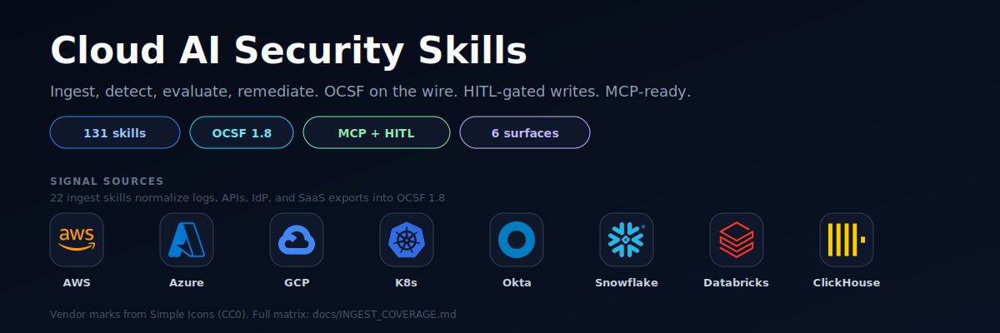
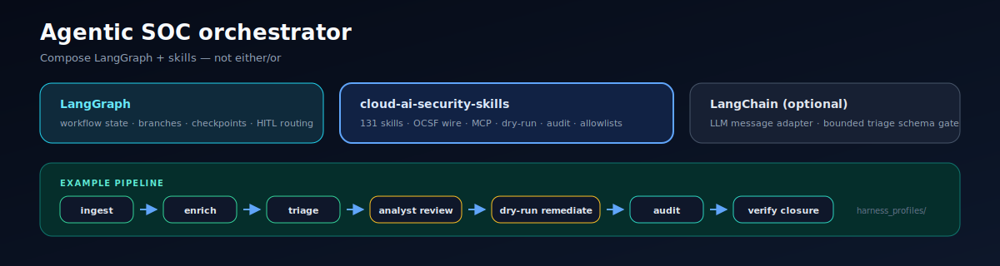

<p align="center">
  <a href="https://github.com/msaad00/cloud-ai-security-skills/actions/workflows/ci.yml?query=branch%3Amain"></a>
  <a href="CHANGELOG.md"></a>
  <a href="LICENSE"></a>
  <a href="https://www.python.org/downloads/"></a>
  <a href="https://schema.ocsf.io/1.8.0"></a>
  <a href="docs/COVERAGE_SNAPSHOT.md"></a>
</p>

<p align="center"><strong>131 deterministic security skills for cloud &amp; AI infrastructure.</strong> Ingest, detect, evaluate, remediate — one bundle on CLI, CI, MCP, webhook, library, and runners.</p>

---

## Start here

| Need | Read |
|---|---|
| Run a pipeline locally | [`docs/QUICKSTART.md`](docs/QUICKSTART.md) |
| Pick a skill | [`docs/SKILL_INDEX.md`](docs/SKILL_INDEX.md) |
| Wire an agent (MCP) | [`docs/AGENT_QUICKSTART.md`](docs/AGENT_QUICKSTART.md) |
| Ship a SOC workflow | [`docs/HARNESS.md`](docs/HARNESS.md) |
| Build a warehouse lake | [`docs/CLICKHOUSE_DATA_LAKE.md`](docs/CLICKHOUSE_DATA_LAKE.md) · [`docs/SNOWFLAKE_DATA_LAKE.md`](docs/SNOWFLAKE_DATA_LAKE.md) |

## Quickstart

```bash
git clone --branch v0.11.0 https://github.com/msaad00/cloud-ai-security-skills.git
cd cloud-ai-security-skills
uv sync --group dev --group aws   # see docs/INSTALL.md for other groups

python skills/ingestion/ingest-cloudtrail-ocsf/src/ingest.py \
       skills/detection-engineering/golden/cloudtrail_raw_sample.jsonl \
  | python skills/detection/detect-aws-access-key-creation/src/detect.py \
  | python skills/view/convert-ocsf-to-sarif/src/convert.py \
  > findings.sarif
```

No clone required for the demo path: [`docs/QUICKSTART.md`](docs/QUICKSTART.md). MCP wiring: repo-root [`.mcp.json`](.mcp.json) + [`docs/integrations/`](docs/integrations/).

## Skills at a glance

| Layer | Count | Output |
|---|---:|---|
| Ingest | 22 | OCSF 1.8 |
| Discover | 5 | native / bridge JSON |
| Detect | 71 | OCSF Detection Finding 2004 |
| Evaluate | 12 | compliance result |
| Remediate | 12 | audited action trail |
| View | 2 | SARIF · Mermaid |
| Output | 3 | S3 · Snowflake · ClickHouse |
| Sources | 4 | warehouse query adapters |

**131 shipped skills.** Live counts: [`docs/COVERAGE_SNAPSHOT.md`](docs/COVERAGE_SNAPSHOT.md). Vendor ingest matrix: [`docs/INGEST_COVERAGE.md`](docs/INGEST_COVERAGE.md). Why not roll your own: [`docs/WHY.md`](docs/WHY.md).

## Architecture

Signals flow intake → analyze → act → persist. Every surface calls the same skill bundle.


Deeper reads: [`docs/ARCHITECTURE.md`](docs/ARCHITECTURE.md) · [`docs/SKILL_CONTRACT.md`](docs/SKILL_CONTRACT.md) · [`docs/diagrams/`](docs/diagrams/)

**Invariant:** skills own facts, schemas, mappings, confidence, and audit. Orchestrators own workflow state and model choice only.

## Workflow packaging — LangGraph, LangChain, and this repo

You do not pick this repo **instead of** LangGraph or LangChain. You compose them. **MCP is the tool surface** — frameworks own workflow state and model choice only.

| Layer | Owns | Shipped here | When to use |
|---|---|---|---|
| **This repo** | security skills, OCSF wire, HITL gates, allowlists, audit | 131 skill bundles + MCP wrapper | always — facts, mappings, and write authority stay here |
| **LangGraph** | multi-step workflow state, branches, checkpoints, HITL routing | [`langgraph_security_graph.py`](examples/agents/langgraph_security_graph.py) + [`harness_profiles/`](examples/agents/harness_profiles/) | durable SOC DAGs, analyst review gates, checkpoint/replay |
| **LangChain** | MCP stdio wiring or optional triage message adapter | [`langchain_mcp_security_agent.py`](examples/agents/langchain_mcp_security_agent.py) + [`harness_adapters.py`](examples/agents/harness_adapters.py) | MCP-first loops **or** bounded LLM drafting inside LangGraph triage |

**LangGraph (recommended for SOC workflows)** — reference harness ships profiles, preflight inspector, eval runner, drift doctor, and optional `StateGraph` runtime. Pipeline: ingest → enrich → triage → analyst review → dry-run remediate → audit → verify closure. Profiles swap allowlists, lake replay vs raw ingest, and model policy without forking skills.

**LangChain (optional glue, not a parallel stack)** — use for MCP stdio config when your client is LangChain-native, or as a chat-message adapter behind the LangGraph triage schema gate. Do **not** wrap skills as LCEL `@tool` chains; the MCP server keeps one audited contract across all clients.

| Pattern | Relevance | Status |
|---|---|---|
| MCP stdio + harness profile | **High** — default for Cursor, Claude, Windsurf, Codex, Cortex, Zed | 10 client examples + `emit_mcp_client_configs.py` |
| LangGraph SOC harness | **High** — durable graph, HITL interrupt/resume, checkpoint replay | CI-tested; `uv sync --group langgraph` |
| LangChain MCP agent | **Medium** — portability for LangChain shops | offline-runnable; `langchain-mcp-adapters` when installed |
| LangChain inside LangGraph triage | **Low–medium** — bounded rank/summarize/draft only | schema-gated; security facts never from the model |
| LCEL skill wrappers | **Avoid** — bypasses audit/HITL | documented anti-pattern in [`examples/agents/README.md`](examples/agents/README.md) |

Packaged profiles (read-only SOC, analyst triage, dry-run remediation) and golden eval fixtures ship under [`examples/agents/`](examples/agents/). Details: [`docs/HARNESS.md`](docs/HARNESS.md).



## Data lakes

Closed-loop lake packs for operator-owned warehouses:

- **ClickHouse** — [`docs/CLICKHOUSE_DATA_LAKE.md`](docs/CLICKHOUSE_DATA_LAKE.md) · [`packs/clickhouse/`](packs/clickhouse/)
- **Snowflake** — [`docs/SNOWFLAKE_DATA_LAKE.md`](docs/SNOWFLAKE_DATA_LAKE.md) · [`packs/snowflake/`](packs/snowflake/)

Write with `sink-*-jsonl`, replay with `source-*-query`, audit rows land back through the same sink.

## Agent integrations

| Client | Doc |
|---|---|
| Claude Code | [`.mcp.json`](.mcp.json) |
| Claude Desktop · Cursor · Windsurf · Codex · Cortex · Zed | [`docs/integrations/`](docs/integrations/) |
| Agent SDK · LangGraph harness | [`examples/agents/`](examples/agents/) |
| Webhook receiver | [`runners/webhook-receiver/`](runners/webhook-receiver/) |
| Python library | [`skills/_shared/library.py`](skills/_shared/library.py) |

Presets: [`presets/`](presets/) · workflows: [`examples/workflows/`](examples/workflows/)

## Trust · compliance · more

| Topic | Doc |
|---|---|
| Trust posture | [`SECURITY.md`](SECURITY.md) · [`SECURITY_BAR.md`](SECURITY_BAR.md) |
| MCP audit contract | [`docs/MCP_AUDIT_CONTRACT.md`](docs/MCP_AUDIT_CONTRACT.md) |
| Framework mappings | [`docs/FRAMEWORK_MAPPINGS.md`](docs/FRAMEWORK_MAPPINGS.md) |
| Security grades | [`docs/SECURITY_GRADES.md`](docs/SECURITY_GRADES.md) |
| Install | [`docs/INSTALL.md`](docs/INSTALL.md) |
| Supply chain | [`docs/SUPPLY_CHAIN.md`](docs/SUPPLY_CHAIN.md) |

<details>
<summary><b>Closed-loop coverage</b> — detections with paired remediation</summary>


Full per-skill matrix: [`docs/FRAMEWORK_COVERAGE.md`](docs/FRAMEWORK_COVERAGE.md) · [`docs/images/coverage-matrix.svg`](docs/images/coverage-matrix.svg)

</details>

<details>
<summary><b>Layer output formats</b> — when OCSF vs native</summary>

| Layer | Default | Why |
|---|---|---|
| Ingest · Detect | OCSF 1.8 | SIEM interop |
| Evaluate | native | ops dashboards |
| Discover | native / CycloneDX | not an event stream |
| Remediate | native | state + audit trail |
| View | SARIF / Mermaid | human review |
| Output | pass-through | producer format |

</details>

## Roadmap · contributing

Roadmap issues: [#253](../../issues/253) · [#254](../../issues/254) · [#255](../../issues/255). PRs: [`CONTRIBUTING.md`](CONTRIBUTING.md). Apache 2.0.

Companion scanner: [`agent-bom`](https://github.com/msaad00/agent-bom).
