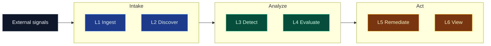

# Architecture

This document is the load-bearing design contract for `cloud-ai-security-skills`. Every future PR is reviewed against it. If you need to deviate, update this doc *in the same PR* — the contract drifts by design, never by accident.

This file is the design contract. It explains how the repo is supposed to work and what future changes must preserve. The visual set lives in [`images/`](images/) and is indexed inline in [`../README.md`](../README.md).

## Quick read

- seven shipped skill layers stay at the center: ingest, discover, detect, evaluate, remediate, view, and output
- two edge or runtime layers sit around them: query packs (L8) and runtime surfaces (L9) — source adapters and sinks are now first-class skill layers under `skills/ingestion/source-*` and `skills/output/`
- one skill bundle contract is shared across CLI, CI, MCP, and runners
- OCSF is the SIEM interop wire format for **ingest and detect**; native / CycloneDX / bridge are correct for discover, remediate, and sinks (see §3.1 for the per-layer applicability table)

<details>
<summary><b>Related contracts and expanded design principles</b></summary>

- **Wire format contract** — see [`../skills/detection-engineering/OCSF_CONTRACT.md`](../skills/detection-engineering/OCSF_CONTRACT.md)
- **Design rationale and product decisions** — see [`./DESIGN_DECISIONS.md`](./DESIGN_DECISIONS.md)
- **Schema versioning and upgrade rules** — see [`./SCHEMA_VERSIONING.md`](./SCHEMA_VERSIONING.md)
- **Sink / persistence contract** — see [`./SINK_CONTRACT.md`](./SINK_CONTRACT.md)
- **Runner / streaming contract** — see [`./RUNNER_CONTRACT.md`](./RUNNER_CONTRACT.md)
- **Runtime isolation and trust boundaries** — see [`./RUNTIME_ISOLATION.md`](./RUNTIME_ISOLATION.md)
- **Threats, actors, and mitigations** — see [`./THREAT_MODEL.md`](./THREAT_MODEL.md)
- **SIEM indexing and dedupe guidance** — see [`./SIEM_INDEX_GUIDE.md`](./SIEM_INDEX_GUIDE.md)
- **Canonical schema contract** — see [`./CANONICAL_SCHEMA.md`](./CANONICAL_SCHEMA.md)
- **Vendor and OCSF normalization reference** — see [`./NORMALIZATION_REFERENCE.md`](./NORMALIZATION_REFERENCE.md)
- **Raw → canonical → native / OCSF / bridge flow** — see [`./DATA_FLOW.md`](./DATA_FLOW.md)
- **Visual guide** — see [`../README.md`](../README.md) for the six-diagram visual set (hero, repo architecture, skill map, agent integrations, shipped flows, IAM departures)

## 1. Purpose and scope

`cloud-ai-security-skills` is a library of **composable security skills for cloud and AI systems** that can operate in native, canonical, OCSF, or bridge modes. The repository is designed to be driven by agentic tools (Claude Code, Snowflake Cortex Code CLI, Claude Agent SDK, any MCP client) *and* by traditional CI / serverless pipelines — with no code changes between the two modes.

**In scope**
- Normalising raw vendor telemetry into canonical or OCSF wire formats
- Running deterministic detection rules on canonical or OCSF streams
- Evaluating raw, canonical, or OCSF telemetry against compliance benchmarks (CIS, NIST, PCI)
- Producing remediation proposals (and, when explicitly authorised, executing them)
- Converting OCSF into downstream wire formats (SARIF, Sigma, Jira, Mermaid)
- Persisting canonical or OCSF records into columnar / lakehouse stores (Snowflake, AWS Security Lake, ClickHouse, BigQuery)
- Exposing every skill as an MCP tool so the same logic runs in every agent

**Out of scope (explicit non-goals)**
- Being a SIEM. SIEMs already ingest OCSF natively (Splunk, Sentinel, Chronicle, Elastic); we are the *producer* of OCSF, not a replacement for the consumer.
- Running a long-lived multi-tenant SaaS runtime. We ship a skills library + reference runners + reference sinks. Productionising those is the operator's responsibility.
- Letting every skill invent its own internal schema. Source-specific payloads are preserved, the repo normalizes them into a canonical internal model, and OCSF remains an interoperable option rather than a mandatory ceiling.
- Real-time sub-second detection. Latency target is minute-scale batches. If you need sub-second, use a streaming runtime (Flink, Kafka Streams) with these skills as UDFs.

## 2. Design principles

These are the non-negotiables. Everything in §3–§8 exists to serve them.

1. **Most skills are pure functions.** Input JSONL → output JSONL. No side effects. No cloud API calls. No disk writes outside stdout. No hidden state. Source, sink, and remediation skills are the explicit edge exceptions.
2. **Side effects live at the edges.** Exactly four categories may have side effects: **L0 sources** (read raw), **L5 remediate** (write cloud APIs), **L7 sinks** (write storage), **runners** (drive loops). Everything else is pure.
3. **The schema contract is the shared dependency.** Skills never import from each other. If two skills need the same logic, they each own a copy. Copy-paste beats coupling at this scale — the contract is the API, not the Python. For shared pipelines the contract may be OCSF; for stateful inventory and evidence it may be canonical or bridge mode.
4. **Determinism.** Same input always produces the same output. Every finding UID is a content hash; no random UUIDs. Replayable ⇒ testable ⇒ idempotent sink merges.
5. **Read-only by default.** A skill may only perform writes if it is prefixed `remediate-*` or `sink-*` and its `SKILL.md` carries an explicit "Do NOT use" clause describing the blast radius.
6. **Least-privilege infra.** Every skill that talks to a cloud API ships the *minimum* IAM policy in `infra/iam_policies/`. Wildcard actions are a CI failure.
7. **MCP-exposable by default.** Every skill must be wrappable as an MCP tool with zero code changes: stdin+args in, stdout out, non-zero exit on error, stderr for warnings. Skills that can't satisfy this don't ship.
8. **Replay-safe persistence.** Database sinks should be idempotent or transactionally safe; object-store sinks should use immutable new-object writes. Re-runs must converge operationally instead of surprising operators.
9. **Dry-run everywhere writes happen.** `--dry-run` is mandatory for every `remediate-*` and `sink-*` skill. It prints the SQL / API calls it *would* make without making them.
10. **Machine-readable write summaries.** Every sink and remediation path must emit a deterministic machine-readable result summary to `stdout`. Some workflows may also feed those results back into an auditable event pipeline, but that is not yet universal across all write surfaces.

## 2.1 Validation, debugging, and API-drift policy

The repo cannot assume cloud APIs stay still. Providers deprecate fields, add enum values, rename resources, or change SDK defaults. We treat that as a normal engineering event, not an exceptional one.

1. **Validate before use.** Skills validate untrusted input before cloud calls, parsing, or conversion. Unknown shapes fail closed unless the skill explicitly supports partial-pass handling.
2. **Use official contracts only.** `REFERENCES.md` links only to official docs, schemas, benchmarks, or SDK references. If a behavior is not grounded in a credible source, it does not belong in a shipped skill.
3. **Debug cleanly.** Structured output goes to `stdout`; warnings, skips, and operator hints go to `stderr`; contract-breaking failures exit non-zero.
4. **Capture drift in tests.** When AWS, Azure, GCP, Kubernetes, or another source adds or deprecates fields, we add regression coverage for both the old and new shapes during the migration window.
5. **Migrate intentionally.** Deprecated APIs are removed only after the replacement path is tested, documented, and reflected in `REFERENCES.md`.

This is how the repo stays secure and reliable without turning every skill into an over-general abstraction layer.

</details>

## 3. Layer model

The repo is easiest to read as **seven shipped skill layers** (ingest, discover, detect, evaluate, remediate, view, output), plus **two edge/runtime layers** (query packs and runtime surfaces) that sit around the pure skills.



The diagram is a layer index, not a second contract: sources feed ingest or
discover paths, pure skills stay in the middle, and sinks/query packs/runtimes
sit at the edges around the same bundle contract.

### Shipped skill layers

| Layer | Primary job | Current category |
|---|---|---|
| L1 | normalize one source into a stable event stream | `skills/ingestion/` |
| L2 | inventory, evidence, AI BOM, and discovery context | `skills/discovery/` |
| L3 | deterministic attack-pattern findings | `skills/detection/` |
| L4 | posture and benchmark evaluation | `skills/evaluation/` |
| L5 | guarded write paths with HITL and audit | `skills/remediation/` |
| L6 | downstream export and conversion | `skills/view/` |

### Edge and runtime layers

| Layer | Role | Current state |
|---|---|---|
| L0 | external sources and vendor APIs | outside the repo boundary |
| L7 | sinks and persistence edges | shipped as the `skills/output/` layer (formerly co-located under `skills/remediation/`) |
| L8 | query packs and warehouse-native analytics | partial shipping |
| L9 | agent/runtime surface (`mcp-server`, runners, wrappers) | shipped as thin wrappers around the same skill contract |

The repo operates across four schema modes:

- **native** for source-fidelity payloads
- **canonical** for stable internal storage, joins, metrics, and state
- **ocsf** for shared pipelines, SIEMs, and standard interoperability
- **bridge** when OCSF transport helps but native or canonical detail still matters

### 3.1 OCSF applicability by layer

OCSF 1.8 is the **SIEM interop wire format**. It is valuable exactly where
events flow to a downstream analyzer (Splunk, Sentinel, Chronicle, Elastic).
It is not the universal internal format, and this repo treats it as a
per-layer choice, not a repo-wide mandate.

| Layer | Default emit | OCSF role | Notes |
|---|---|---|---|
| **L1 Ingest** | OCSF 1.8 (native opt-in) | Default — SIEM interop | Raw vendor → OCSF is what OCSF was built for. Every ingester offers `--output-format ocsf` by default |
| **L3 Detect** | OCSF Detection Finding 2004 (native opt-in) | Default — SIEM interop | Findings flow to SIEM / SOAR / ticketing. OCSF spares every downstream from writing a custom parser. MITRE ATT&CK lives under `finding_info.attacks[]` |
| **L4 Evaluate / CSPM** | native by default; OCSF Compliance Finding 2003 opt-in | Optional | Ops dashboards prefer native; SIEM pipelines can opt into OCSF. Evaluation ships as **dual output**, not a forced replacement |
| **L2 Discover** | native / CycloneDX ML-BOM / bridge | **Not a good fit** | Inventory graphs, AI BOM, evidence snapshots are state, not events. OCSF Inventory Info 5001 is too thin to be worth forcing |
| **L5 Remediate** | native | **Not a good fit** | Remediation is a state change with an operator-owned audit record, not a finding. `iam-departures-aws` and `remediate-okta-session-kill` both emit native |
| **L6 View** | OCSF input required, SARIF / Mermaid output | Consumer of OCSF | The whole point of these converters is rendering OCSF for humans |
| **L7 Output (sinks)** | pass-through | Format-agnostic | Sinks write whatever the producer emitted |
| **L0 Sources** | pass-through | Format-agnostic | Warehouse query adapters yield whatever the source held |

Most current ingest and detect paths are **fully dual-mode** and can emit either
repo-native JSONL or OCSF JSONL via `--output-format`. Discovery and evidence
paths may emit deterministic native or canonical artifacts, plus OCSF bridge
events where that improves interoperability. Evaluation, sink, and remediation
outputs remain primarily native because they are repo-owned operational
contracts rather than clean OCSF fits.

The principle: **pick the format that fits the semantic of the layer.** OCSF
where events flow to analyzers; native where the signal is state,
configuration, or an audit trail; CycloneDX where the artifact is an SBOM.
The frontmatter `output_formats` field on each SKILL.md declares which modes
a skill supports; `--output-format` is the runtime switch.

Execution-mode note:
- `execution_modes: persistent` means a skill is safe to embed in a persistent runner, queue consumer, scheduler, or serverless loop without changing the skill logic
- it does **not** mean the repo already ships that runner, daemon, or sink for every skill
- today, the runner and sink layers are shipped as reference patterns, not as dedicated wrappers for every single skill family

For the detailed contract, see:

- [`NATIVE_VS_OCSF.md`](./NATIVE_VS_OCSF.md)
- [`SCHEMA_VERSIONING.md`](./SCHEMA_VERSIONING.md)
- [`CANONICAL_SCHEMA.md`](./CANONICAL_SCHEMA.md)
- [`DATA_FLOW.md`](./DATA_FLOW.md)
- [`STATE_AND_TIMELINE_MODEL.md`](./STATE_AND_TIMELINE_MODEL.md)
- [`../skills/detection-engineering/OCSF_CONTRACT.md`](../skills/detection-engineering/OCSF_CONTRACT.md)

### How to read this doc

- `ARCHITECTURE.md` is the design contract and review baseline.
- The visual set lives in `images/` and is indexed in the top-level `README.md`.
- the SVGs should simplify the design, not replace it
- if a diagram and this doc disagree, this doc wins until both are updated in the same PR

### Layer status snapshot

| Layer | Status | Current shape |
|---|---|---|
| L0 external sources | external | cloud APIs, raw logs, SaaS identity feeds, lakehouse tables |
| L1 ingest | shipping | 17 source-specific ingesters plus 3 read-only source adapters; ingest and detect are fully dual-mode where OCSF-native parity makes sense |
| L2 discover | shipping | environment graph, AI BOM, cloud control evidence, control evidence |
| L3 detect | shipping | 64 shipped detectors across cloud, identity, Kubernetes, MCP / agent, warehouse, and SaaS signals (GitHub, Slack) |
| L4 evaluate | shipping | 7 benchmark and posture skills across AWS, GCP, Azure, Kubernetes, containers, GPU, and model-serving paths with native and opt-in OCSF 2003 output |
| L5 remediate | shipping | IAM departures is the flagship write path; Okta session kill ships as the containment remediator |
| L6 view | shipping | SARIF and Mermaid attack-flow exports |
| L7 sinks | shipping | `sink-snowflake-jsonl`, `sink-clickhouse-jsonl`, and `sink-s3-jsonl` ship today under `skills/output/` |
| L8 query packs | partial shipping | `packs/lateral-movement/` and `packs/privilege-escalation-k8s/` are shipped; broader pack coverage remains future work |
| L9 agent/runtime surfaces | shipping | `mcp-server`, CLI, CI, and runners call the same skill contract |

<details>
<summary><b>Expanded execution, layout, guardrails, and roadmap</b></summary>

## 4. Two execution modes

Skills never change between modes. What changes is **what drives them**.

### Mode A — Batch (stateless)

Finite input, pipe through skills, write the output somewhere. This is the default mode and the only one required for a working install.

```
cat cloudtrail.json \
  | python3 skills/ingestion/ingest-cloudtrail-ocsf/src/ingest.py \
  | python3 skills/detection/detect-lateral-movement/src/detect.py \
  | python3 skills/view/convert-ocsf-to-sarif/src/convert.py \
  > findings.sarif
```

Used by: Claude Code ad-hoc analysis, CI, one-off investigations, compliance snapshots, and local pipeline runs.

Properties: zero infrastructure, no state, perfectly reproducible, no persistence, single-shot.

### Mode B — Streaming / continuous

A **runner** (L9 driver, not a skill) drives the skills in a loop from a source queue to a sink. The runner is the only component with state (checkpoint offsets).

```
 S3 notification SQS           skill loop                    sink
 ─────────────────▶  runner-s3-to-snowflake  ─▶  ingest-* → detect-* → sink-snowflake
                         │
                         └─ checkpoint state in DynamoDB / Snowflake STREAM
```

Shipped reference runners:
```
runners/aws-s3-sqs-detect              # S3 -> ingest Lambda -> SQS -> detect Lambda -> DynamoDB dedupe -> SNS
runners/gcp-gcs-pubsub-detect          # GCS -> ingest function -> Pub/Sub -> detect function -> Firestore dedupe
runners/azure-blob-eventgrid-detect    # Blob -> Event Grid -> Service Bus -> handlers -> Table Storage dedupe
```

Future runner variants could follow the same contract:
```
runners/runner-s3-to-snowflake          # S3 → skill → Snowflake COPY INTO
runners/runner-eventbridge-to-security-lake   # EventBridge → skill → Parquet → Security Lake
runners/runner-pubsub-to-clickhouse     # Google Pub/Sub → skill → ClickHouse INSERT
runners/runner-eventhubs-to-bigquery    # Azure Event Hubs → skill → BigQuery JSON load
```

Properties: persistent state lives *only* in the runner (checkpoint) and sink (materialised rows). The skills themselves remain stateless, so failure recovery is: re-drive the runner from the last checkpoint, let idempotent sink merges collapse the duplicates.

### Where AI BOM fits

An AI BOM capability belongs in the **discovery / inventory path**, not as the identity of the repo.

- **Collection** lives near L0/L1 when enumerating models, gateways, vector stores, runtimes, policies, and dependencies from vendor APIs or config exports.
- **Normalization** should emit OCSF-compatible inventory or application-context records rather than inventing a new private schema.
- **Enrichment** belongs in L2 when joining model inventory, framework metadata, package provenance, and control coverage into a usable graph.
- **Evaluation** belongs in L4 when mapping that inventory to MITRE ATLAS, NIST AI RMF, OWASP LLM Top 10, or other AI-security frameworks.

That keeps AI BOM as one valuable skill family inside `cloud-ai-security-skills`, instead of pulling the whole repo away from its broader cloud + AI security scope.

### Why this works: idempotency

Every OCSF event we emit carries a deterministic UID derived from content, never from wall clock or RNG. Today:

- **Findings**: `finding_info.uid = det-<rule>-<short(semantic_key)>`. Example: `det-lm-1f455f51-cbef99b7-9ea97278` is the (provider, session, dst-ip, dst-port) hash for the cross-cloud lateral-movement rule. Running the same input a thousand times yields the same uid.
- **Ingested events**: inherit the source event's immutable ID (`eventID` for CloudTrail, `Id` for GuardDuty, etc.). Ingest is content-addressable.

Sinks exploit this: `MERGE INTO ocsf_findings USING input ON input.finding_info.uid = target.finding_info.uid WHEN MATCHED THEN UPDATE SET ... WHEN NOT MATCHED THEN INSERT ...`. Replaying a day's worth of raw events after a sink outage **converges to the same table state**.

## 5. Directory layout

### Current layered tree

```
cloud-ai-security-skills/
├── skills/
│   ├── ingestion/               # L1
│   ├── discovery/               # L2 discovery / inventory
│   ├── detection/               # L3
│   ├── evaluation/              # L4
│   ├── view/                    # L6
│   ├── remediation/             # L5
│   └── detection-engineering/   # shared OCSF contract + golden fixtures
├── tests/integration/
├── .github/workflows/
└── docs/
    └── ARCHITECTURE.md  (this file)
```

### Near-term target

```
cloud-ai-security-skills/
├── skills/
│   ├── ingestion/            # L1
│   ├── discovery/            # L2
│   ├── detection/            # L3
│   ├── evaluation/           # L4
│   ├── view/                 # L6
│   ├── remediation/          # L5
│   └── output/               # L7 — sink-* skills that persist findings/evidence/audit
├── runners/                  # Mode B drivers
│   ├── runner-s3-to-snowflake/
│   └── runner-eventbridge-to-security-lake/
├── mcp-server/               # L9 — single cross-cutting server
│   ├── src/server.py
│   ├── src/tool_registry.py
│   └── tests/
├── packs/                    # L8 — SQL packs and warehouse-native analytics
│   ├── lateral-movement/
│   ├── privilege-escalation-k8s/
│   ├── clickhouse/
│   └── snowflake/
├── tests/integration/
└── docs/
    ├── ARCHITECTURE.md
    ├── OCSF_CONTRACT.md       # optional future move from skills/detection-engineering/
    ├── SINK_CONTRACT.md       # new, PR T
    └── RUNNER_CONTRACT.md     # new, PR V
```

**Rationale for separating `sinks/`, `runners/`, `mcp-server/`, and `packs/` from `skills/`:** the "skills are pure, edges have side effects" mental model becomes visible in the directory tree. A reviewer can tell at a glance whether a change touches pure code or effectful code. This is cheap documentation that pays for itself on every PR.

Sinks live under `skills/output/` as a first-class layer alongside ingestion,
detection, evaluation, view, and remediation. They are intentionally separate
from `skills/remediation/`: sinks persist records, remediations take mutating
actions against identity or cloud-config. Keeping the layers distinct keeps the
"skills are pure, edges have side effects" mental model honest in the tree.

The layered skill directories are now canonical. `skills/detection-engineering/`
remains only as the shared OCSF contract and frozen-fixture namespace used by
ingestion, detection, and view skills.

## 6. Wire contract (OCSF 1.8)

See [`../skills/detection-engineering/OCSF_CONTRACT.md`](../skills/detection-engineering/OCSF_CONTRACT.md) for the field-level contract every event must satisfy. Summary:

- **Base schema:** OCSF 1.8.0, no exceptions.
- **Wire format:** JSONL, UTF-8, LF, no BOM.
- **Transport:** stdin / stdout by default, `--input` / `--output` optional.
- **Error handling:** malformed lines are skipped with a stderr warning — never fatal. Detection pipelines must not crash on one bad event.
- **Detection findings:** class **2004** (`Detection Finding`). Class 2001 (`Security Finding`) is deprecated since OCSF 1.1 and forbidden in this repo.
- **MITRE ATT&CK:** version v14, pinned. `attacks[]` lives inside `finding_info`, not at the event root.
- **Custom fields:** forbidden at the base level. Custom MCP-specific fields live under a documented profile extension (`cloud_security_mcp`).

### Event UID rules

| Event kind | UID derivation |
|---|---|
| Ingested (L1) | Inherit source event's immutable ID (CloudTrail `eventID`, GuardDuty `Id`, ASFF `Id`, K8s audit `auditID`). |
| Detection finding (L3) | `det-<rule-slug>-<short-sha256(semantic-key)>` where semantic-key is the tuple of observables that defines "the same finding" (session + dst for lateral movement, cluster + subject for k8s privesc, etc.). |
| Compliance finding (L4) | `eval-<benchmark>-<control-id>-<target-uid>`. Same target evaluated twice must yield the same UID. |
| Remediation action (L5) | `remediate-<action>-<target-uid>-<ts-day>`. Day-bucketed so the same day's replay dedupes but tomorrow's re-run creates a new audit record. |
| Sink audit (L7) | `sink-<sink-name>-<input-uid>`. Emitted as an OCSF 6002 self-audit event per rule 10. |

## 7. Guardrails (10 rules, expanded)

Each rule, the reason, and the concrete enforcement mechanism.

1. **Pure functions.** *Enforcement:* CI runs `bandit` with `B310` (urllib) and `B605` (subprocess) enabled on everything under `skills/` except `remediate-*`, `sink-*`, and `runners/`. Any network or subprocess call outside those categories fails the build.

2. **Side effects live at the edges.** *Enforcement:* `CODEOWNERS` requires a security reviewer on any PR that touches `remediate-*/`, `sink-*/`, or `runners/`. Pure-skill PRs don't need this.

3. **No cross-skill imports.** *Enforcement:* CI lint rule — any `from ..` or `from ...` import inside `skills/*/*/src/` fails. A skill may import only from its own `src/` or from the Python stdlib.

4. **Determinism.** *Enforcement:* every skill ships golden fixtures and a `test_deep_eq_against_frozen_golden` test. Re-running the skill against the raw input must produce byte-identical output to the frozen OCSF JSONL.

5. **Read-only by default.** *Enforcement:* `SKILL.md` frontmatter has a required `capability` field. Valid values: `read-only`, `write-remediation`, `write-sink`, `write-runner`. CI rejects a skill with no `capability` field.

6. **Least-privilege IAM.** *Enforcement:* every `remediate-*` and `sink-*` skill ships `infra/iam_policies/*.json`. CI runs `iam-policy-lint` to reject wildcard `Action: "*"` or wildcard `Resource: "*"` unless the policy carries an explicit `# WILDCARD_OK: reason` comment.

7. **MCP-exposable.** *Enforcement:* the `mcp-server/` test suite auto-discovers every skill and calls it via the MCP protocol with its golden input. Any skill that doesn't round-trip through MCP fails the build.

8. **Idempotent sinks.** *Enforcement:* `SINK_CONTRACT.md` defines the required MERGE key (`finding_info.uid` for finding classes, source event ID for ingested classes). A sink's test suite must run the golden fixture twice and assert the target row count is unchanged on the second run.

9. **Dry-run everywhere writes happen.** *Enforcement:* every `remediate-*` and `sink-*` skill must accept `--dry-run` and its test suite must verify zero writes occur when the flag is set.

10. **Audit the auditor.** *Enforcement:* every sink write emits an OCSF 6002 Application Activity event to a separate `sink_audit` stream. Grafana / Cortex has a dashboard pack that surfaces "who wrote what when".

## 8. Agent integration — the MCP layer

This section is the heart of the design. Without it, each agent (Claude Code, Cortex Code, Agent SDK, custom) would need per-agent glue. With it, **writing a new skill automatically makes it available to every agent.**

### Architecture

```
┌──────────────────┐
│  Claude Code     │── Bash tool (direct) ──────┐
├──────────────────┤                            │
│  Claude Code     │── MCP client ───┐          │
├──────────────────┤                 │          │
│  Cortex Code CLI │── MCP client ───┤          │
├──────────────────┤                 │          │
│  Claude Agent SDK│── MCP client ───┼──────►  mcp-server ◄── auto-discovers
├──────────────────┤                 │            │           skills/*/src/*.py
│  custom agent    │── MCP stdio ────┘            │
└──────────────────┘                              ▼
                                          subprocess invoke
                                           (stdin JSONL in,
                                            stdout JSONL out)
```

### How `mcp-server/` works

1. **Auto-discovery** — walks `skills/*/*/SKILL.md`, parses the frontmatter (`name`, `description`), classifies the skill (`read-only` vs write-capable), and resolves a fixed entrypoint (`src/<ingest|detect|checks|convert|discover>.py`).
2. **Tool spec generation** — each skill becomes one MCP tool. Tool name = `SKILL.md` `name` field. Tool description = the full frontmatter `description` (which already leads with "Use when…" and closes with "Do NOT use…" per the Anthropic pattern).
3. **Input schema** — current implementation exposes a conservative `input: string` (stdin payload) and `args: string[]` (fixed CLI args passed to the skill entrypoint). This keeps the wrapper thin and avoids inventing a second API surface. Tighter CLI-derived schemas are a follow-up.
4. **Invocation** — the server shells out to `python3 <skill-path>/src/<entry>.py`, streams the tool's `input` to the skill's stdin, captures stdout, and wraps non-zero exits as MCP tool errors with stderr attached.
5. **Transport** — stdio (local) ships now. HTTP/SSE stays a follow-up for hosted deployments.

### Why MCP and not a bespoke API

- Claude Code can call skills via Bash *or* MCP — flexibility is free.
- Cortex Code CLI supports *only* MCP (no general Bash tool), so MCP is the **required** path for Snowflake-agent coverage.
- Claude Agent SDK has first-class MCP support.
- Any custom agent with an MCP client (growing list) gets the library for free.
- MCP is an open protocol; we incur no vendor lock-in by adopting it.

### What MCP does **not** do

- It does not make skills stateful. The server is a thin wrapper; state still lives only in sinks and runners.
- It does not aggregate results. A multi-step analysis is still a composition of tool calls orchestrated by the agent, not a monolithic "analyze_everything" endpoint.
- It does not authenticate end users. Auth is the embedding application's responsibility — the MCP server trusts its caller.

## 9. Security posture

This section governs what happens the moment the repo graduates from "Unix filter toy" to "persistent security telemetry pipeline" (i.e. any time a sink or runner is deployed).

| Concern | Control | Enforced where |
|---|---|---|
| Encryption at rest | Native: Snowflake column encryption, Security Lake S3 SSE-KMS, ClickHouse disk encryption | Sink DDL ships with encryption enabled; CI rejects unencrypted table definitions |
| Encryption in transit | TLS 1.2+ on every connection; sinks reject plaintext | Sink connection code validates scheme |
| Credentials | Vault / Secrets Manager / KMS-wrapped only. Sinks refuse to run if a literal long-lived key is in env. | Sink startup check |
| IAM | Per-sink role: `CREATE TABLE` + `MERGE INTO` on `ocsf_*` schema, nothing else. Policy shipped in `infra/iam_policies/<sink-name>.json`. | `iam-policy-lint` CI check |
| Multi-tenancy | Row-level security on `cloud.account.uid`. Snowflake RLS policy, ClickHouse row policy, Security Lake S3 prefix partitioning. | Sink schema ships the RLS / row-policy DDL |
| Retention | Storage-layer TTL. Default 90d hot, auto-archive to 7y for audit classes. | DDL |
| PII | Field-level redaction hook at L2 (`enrich-pii-redact-ocsf`, PR X-P0) **must** run before any sink in a regulated environment. Config file defines redaction rules per field path. | Runner refuses to start a pipeline targeting a sink without PII redaction enabled, unless `--regulated=false` is set explicitly |
| Tamper detection | Sinks sign each batch with a rolling HMAC over a key in KMS. Downstream `query-tamper-check` skill detects gaps and signature mismatches. | SINK_CONTRACT.md, PR T |
| Separation of duties | `sink-*` skills run with **write-only** creds (no SELECT grant). `query-*` skills run with **read-only** creds. They never share a role. | IAM policies |
| Audit | Every sink write and every remediation action emits an OCSF 6002 self-audit event into a separate `sink_audit` stream. | Rule 10 |
| Network | Sinks must tolerate egress restrictions — all use official vendor SDKs which honour VPC endpoints / private links. | Test suite runs sinks with `http_proxy=invalid` and asserts they use the SDK, not direct HTTP |

## 10. Determinism and idempotency — worked example

This is the property that lets Mode A and Mode B share the same skill code. Worked example using `detect-lateral-movement`:

**Input** — one CloudTrail AssumeRole event + one VPC Flow ACCEPT to 10.0.3.75:3306, same session.

**Deterministic UID** — rule computes `session_uid = "ASIASESSION001"`, `dst_key = "10.0.3.75:3306"`, then `uid = "det-aws-lm-" + sha256(session_uid)[:8] + "-" + sha256(dst_key)[:8]`. This yields `det-aws-lm-cbef99b7-9ea97278` regardless of when or where the rule runs.

**Replay scenarios:**

| Scenario | Sink behaviour |
|---|---|
| Raw events fed once, sink healthy | 1 row inserted |
| Raw events fed again (Mode B retry after outage) | `MERGE` matches on uid → `UPDATE` (no-op if payload unchanged) |
| Raw events fed with a new flow at 5 min 10s (second flow, same session, same dst) | Deduped in-skill by `(session, dst_ip, dst_port)` — still 1 uid, still 1 row |
| Raw events fed with a flow to a *different* dst | New uid, new row |
| Day's worth of raw events replayed from S3 after a 6h sink outage | Every finding's `MERGE` key already exists → 0 duplicates, converged state |

This is what "OCSF can persist + update" means in practice: every finding is *already* an upsert key. The sink never needs a generated primary key.

## 11. Extending the repo

### Adding a new skill

1. Pick the layer (L1 ingest, L2 enrich, L3 detect, L4 evaluate, L5 remediate, L6 convert).
2. Copy the nearest sibling as the starting point — the existing skills in the target category are the canonical reference.
3. Write `SKILL.md` with the spec-compliant frontmatter, leading `description` with "Use when…" and closing with "Do NOT use…". Include the `capability` field.
4. Implement `src/<entry>.py` as a pure Unix filter: stdin JSONL in, stdout JSONL out, stderr for warnings.
5. Write tests in `tests/test_<entry>.py`. Include:
   - Unit tests for every helper.
   - Positive golden-fixture parity tests.
   - Negative controls (at least 3, explaining what should **not** fire).
6. Register the skill in `.github/workflows/ci.yml` matrix.
7. If the skill adds a new MITRE technique, add it to `OCSF_CONTRACT.md`'s pinned table.
8. Run `pytest`, `ruff check`, `ruff format`, open a PR.

### Adding a new sink (PR T pattern)

1. Create `sinks/sink-<name>-ocsf/` with the same SKILL.md + src + tests + infra layout.
2. Ship `infra/schema.sql` with encrypted, RLS-policied DDL.
3. Ship `infra/iam_policies/sink-write.json` with minimum grants.
4. Implement a pure mode A pathway: `cat ocsf.jsonl | python src/load.py --dry-run` prints the exact SQL / API calls.
5. Implement the wet pathway behind `--dry-run=false`.
6. Add two idempotency tests: same input run twice must yield unchanged row count.
7. Add a sink-audit test: confirm the sink emits an OCSF 6002 event about itself.
8. Add CI matrix entry.

### Adding a new runner (PR V pattern)

1. Create `runners/runner-<source>-to-<sink>/` with SKILL.md + src + tests.
2. Implement checkpoint persistence (DynamoDB, Snowflake STREAM, GCS blob, Azure Storage — pick one per runner).
3. Runner must be idempotent against checkpoint replay: running from `checkpoint_n - 10 batches` must converge.
4. Test with a fake source queue and a fake sink that records its MERGE operations.

## 12. Versioning and compatibility

- The **wire contract** (OCSF version + custom profile version + MITRE version) is pinned in `OCSF_CONTRACT.md` under `contract version: 1.8.0+mcp.2026.04`. To bump: cut a new contract version and re-freeze every skill's golden fixtures in one PR. We do not mix contract versions across skills.
- **Skill implementations** are versioned by git commit. A skill has no version number; its behaviour is defined by its test fixtures, which are frozen.
- **Repo releases** cut tagged versions (`v0.N.M`) that snapshot a known-good combination of contract + skills + sinks + runners. CI smoke-tests the release's end-to-end pipes before the tag is pushed.
- **Breaking changes** to the contract are allowed at minor-version boundaries, must update every skill in the same PR, and must ship a migration note in `docs/MIGRATIONS.md`.

## 13. Roadmap (dependency-ordered)

This is the architectural roadmap. Vendor-story PRs (#29–#39) continue in parallel and land on whatever the top-of-stack layout is.

| PR | Scope | Priority | Why |
|---|---|---|---|
| **ARCHITECTURE.md** | This document | **P0** | Locks the design so every subsequent PR lands correctly |
| **PR #39 reshape** | `git mv` skills into `ingest-*`, `evaluate-*`, `remediate-*`, etc. Add empty `sinks/` `runners/` `mcp-server/` `query/` dirs with READMEs. | **P0** | Without this, later PRs land in the wrong place and we pay for it twice |
| **PR U — mcp-server** | Auto-discover every skill, expose via MCP stdio + HTTP/SSE, test against Claude Code + Cortex Code CLI | **P0** | The single highest-leverage PR: unlocks every agent for every future skill |
| **PR T — sink-snowflake-ocsf** | Schema DDL, COPY INTO loader, idempotent MERGE, Cortex query pack, Cortex Analyst semantic model | **P0** | Proves the persistent mode works end-to-end, directly enables Cortex Code CLI users |
| **PR X — enrich-pii-redact-ocsf** | Field-level redaction with rule config, **gates every sink run in regulated mode** | **P0** | Regulatory prerequisite — no sink runs in a regulated environment without it |
| **PR V — first runner** | `runner-s3-to-snowflake` with checkpoint state, idempotency tests | P1 | Proves streaming mode works. Unlocks continuous pipeline |
| **PR W — sink-security-lake-ocsf** | OCSF Parquet with AWS Security Lake partitioning (zero-transform target) | P1 | Most strategic sink — AWS Security Lake *is* OCSF-native |
| **PR Y — Ramp vendor story** | `ingest-ramp-ocsf` + `detect-ramp-vendor-change-with-payment` + `detect-ramp-spend-limit-bypass` + `detect-ramp-card-to-unknown-merchant` | P1 | First non-cloud, business-logic vendor story |
| **PR Z — ingest-snowflake-audit-ocsf** | Snowflake `ACCOUNT_USAGE` audit into OCSF | P2 | Closes the loop: Cortex Code users can detect on their own platform |
| ~~**PR AA — sink-clickhouse-ocsf**~~ **(shipped — Unreleased)** | MergeTree DDL pack (`packs/clickhouse/`), `sink-clickhouse-jsonl` write side, `source-clickhouse-query` read side, materialized-view rollups, row-policy tenant isolation, [`docs/CLICKHOUSE_DATA_LAKE.md`](CLICKHOUSE_DATA_LAKE.md) hero use case | done | Closes the ClickHouse story end-to-end |
| ~~**PR AC — snowflake-hero-data-lake**~~ **(shipped — Unreleased)** | DDL pack (`packs/snowflake/`) with VARIANT sinks, dynamic-table rollups, row access policies, and an optional Snowflake-managed Iceberg variant; pairs the existing `sink-snowflake-jsonl` + `source-snowflake-query` skills with [`docs/SNOWFLAKE_DATA_LAKE.md`](SNOWFLAKE_DATA_LAKE.md) | done | Closes the Snowflake story end-to-end (warehouse-native, open-format lane) |
| **PR BB — enrich-asset-inventory-ocsf** | Joins findings with `discover-environment` graph | P2 | Turns findings into triageable blast-radius context |

## 14. Non-goals (explicit)

To keep this doc honest:

- **Not a SIEM.** Splunk, Sentinel, Chronicle, and Elastic already consume OCSF natively. If you have one of those, pipe our output into it — we are the *producer*.
- **Not a runtime.** We ship a library + reference runners + reference sinks. Running a 24/7 multi-tenant production pipeline is an integration task the operator owns.
- **Not a rule engine.** We ship deterministic Python rules. If you need a declarative DSL, convert our OCSF to Sigma and load it into your DSL engine.
- **Not a UI.** `query/` ships SQL packs and Grafana dashboards; we do not ship a proprietary web UI. Grafana + Cortex are the "UI".
- **Not a SOAR.** `remediate-*` skills propose fixes. Production SOAR orchestration is the operator's responsibility.
- **Not a replacement for official SDKs.** Sinks use the official vendor SDK (Snowflake Python connector, `boto3`, `google-cloud-*`, `azure-*`). We do not reimplement API clients.

## 15. Glossary

| Term | Meaning |
|---|---|
| **Skill** | A self-contained Anthropic-spec skill bundle: `SKILL.md` + `src/` + `tests/` + optional `REFERENCES.md` + optional `infra/`. One purpose, one wire contract. |
| **Layer** | A logical stage in the pipeline (L0–L9). Each layer has exactly one category of side-effect profile. |
| **Sink** | A side-effectful skill that persists OCSF to external storage. Lives in `sinks/`, not `skills/`. |
| **Runner** | A driver process that runs skills in a loop from a source queue to a sink. Lives in `runners/`, not `skills/`. |
| **Wire contract** | The OCSF 1.8 + MITRE v14 + MCP-profile pinning in `OCSF_CONTRACT.md`. The only shared dependency. |
| **MCP tool** | An MCP-protocol-exposed callable. Every skill is automatically one, via `mcp-server/`. |
| **Mode A** | Batch execution. Finite input, Unix pipes, no persistence. The default. |
| **Mode B** | Streaming execution. Runner drives skills in a loop, state lives only in the runner checkpoint and the sink. |
| **Deterministic UID** | A content-addressed identifier. Same semantic input → same UID. The property that makes idempotent sinks work. |
| **Read-only by default** | The baseline posture: no skill performs writes unless it is `remediate-*` or `sink-*` and has an explicit "Do NOT use" clause. |

</details>

---

*Changelog — update this section in every PR that amends this file.*

| Version | Date | Change |
|---|---|---|
| 1.0 | 2026-04-11 | Initial architecture document. Codifies the 9-layer model, two execution modes, 10 guardrails, MCP integration strategy, security posture, and the dependency-ordered roadmap. |
