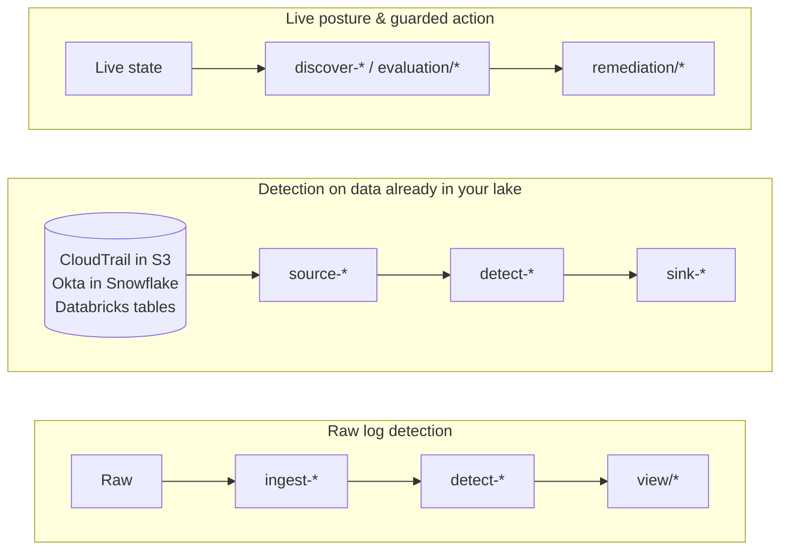

# Data Handling

This file explains how data is acquired, normalized, analyzed, persisted, and
protected across the repo's main execution paths.

Use this doc when you need to answer:

- where data starts
- which skill family should touch it first
- which runtime or deployment shape is actually shipped today
- what format it is in at each stage
- when `native`, `ocsf`, `canonical`, or `bridge` matters
- what security controls apply on each path

## Quick Visual

Start with the real input you have, then follow the first skill family, the
output shape, and the control boundary:



The visual is intentionally short. The details stay below in tables and worked
examples.

## One Skill Bundle, Many Access Paths

The repo ships skill bundles, not just standalone scripts.

Each bundle includes:

- `SKILL.md`
- `REFERENCES.md`
- `src/`
- `tests/`

The executable Python entrypoint is the runtime core inside that bundle. Agent
tools and wrappers call the same skill bundle; they do not replace it.

| Access path | What is actually running |
|---|---|
| direct CLI | the skill's `src/<entry>.py` execution core |
| MCP | local wrapper plus the skill bundle contract from `SKILL.md` |
| CI | workflow step invoking the same skill bundle and validating its output |
| runner | serverless or queue wrapper invoking the same skill bundle |
| query pack | SQL equivalent for selected warehouse-native detections |

Short rule:

- these are agent-usable skills
- they are not agent-only skills
- the normal agent path is MCP tool calling by skill name
- the direct Python entrypoint is the clearest wrapper-free execution example
- the full skill contract still lives in the bundle, not just the script file

Read next:

- [DATA_FLOW.md](DATA_FLOW.md)
- [RUNTIME_ISOLATION.md](RUNTIME_ISOLATION.md)
- [RUNTIME_PROFILES.md](RUNTIME_PROFILES.md) (runner templates, regenerated on every CI run)
- [RUNTIME_PROFILES_SKILLS.md](RUNTIME_PROFILES_SKILLS.md) (skill-family sizing guidance)
- [NATIVE_VS_OCSF.md](NATIVE_VS_OCSF.md)

## The Main Scenarios

| Scenario | Start with | Typical path | Primary formats | Main controls |
|---|---|---|---|---|
| Point-in-time posture or inventory | live cloud or SaaS API | `discover-*` or `evaluation/*` | native, sometimes bridge | read-only creds, least privilege, no hidden writes |
| Raw event logs on disk or stdin | vendor payloads | `ingest-* -> detect-* -> view/*` | native or OCSF | defensive parsing, deterministic IDs, fixture-tested transforms |
| Read-only data lake or warehouse rows | `source-*` skill or direct SQL | `source-* -> detect-*` if already shaped | raw, native, or OCSF | query restrictions, read-only creds, no arbitrary shell |
| Warehouse rows that still need normalization | `source-*` + ingester | `source-* -> ingest-* -> detect-*` | raw -> canonical -> native or OCSF | same ingest controls, plus read-only source adapter boundary |
| Continuous detection or scheduled pipelines | runner or serverless wrapper | runner -> `ingest-* -> detect-* -> sink-*` | native, OCSF, sink results | dedupe, retries, isolated principals, append-only audit |
| Guarded operational writes | remediation skill | event -> `remediation/*` -> audit trail | native operational result | HITL, `--dry-run`, explicit approval, blast-radius docs |

## Available Today

| Option | Shipped today | Start with | Use it when |
|---|---|---|---|
| Local CLI pipeline | yes | direct skill entrypoint | you want one-shot analysis, fixture testing, or debuggable local runs |
| CI pipeline | yes | GitHub Actions or similar wrapper | you want repeatable checks, SARIF, snapshots, or release validation |
| MCP tool calling | yes | `mcp-server/` | you want local agent composition with the same skill contracts |
| Persistent AWS runner | yes | `runners/aws-s3-sqs-detect` | you want S3 -> ingest -> detect -> sink style event processing |
| Persistent GCP runner template | yes | `runners/gcp-gcs-pubsub-detect` | you want GCS/PubSub style event-driven execution |
| Persistent Azure runner template | yes | `runners/azure-blob-eventgrid-detect` | you want Blob/Event Grid style event-driven execution |
| Warehouse source adapter | yes | `source-snowflake-query`, `source-databricks-query` | your data already lives in a lake or warehouse and you want read-only extraction |
| Object-store source adapter | yes | `source-s3-select` | your source data lives in S3 and you want read-only extraction before analysis |
| Warehouse-native analytics pack | yes, partial | `packs/` | you want the detection to run in Snowflake or Databricks instead of Python |
| Sink / persistence edge | yes | `sink-*` | you want durable storage in Snowflake, ClickHouse, or S3 |

## Ingestion And Selection Options

| Data starts as... | Choose this first | Real path today |
|---|---|---|
| live cloud or SaaS state | `discover-*` or `evaluation/*` | API call -> native or bridge output |
| raw file or stdin payload | `ingest-*` | raw -> canonical -> native or OCSF |
| raw warehouse row | `source-*` then `ingest-*` | source adapter -> ingester -> detector |
| already-shaped OCSF or native row | `detect-*` directly | source adapter or local file -> detector |
| warehouse-scale historical analysis | `packs/` | warehouse table/view -> SQL pack -> OCSF-compatible result |
| findings or evidence that must persist | `sink-*` | skill output -> sink result + customer-owned storage |
| operational action request | `remediation/*` | approved event -> plan/action -> audit trail |

## Data Lifecycle

| Stage | What happens | Typical skill families | Formats | Security posture |
|---|---|---|---|---|
| Acquire | read cloud state, files, stdin, or warehouse rows | `source-*`, `discover-*`, `evaluation/*`, `ingest-*` | raw, native, canonical | read-only by default, scoped credentials, no generic shell passthrough |
| Normalize | preserve source truth in a stable internal model | `ingest-*` | canonical internally, then native or OCSF outward | schema validation, lossiness documented, deterministic timestamps and IDs |
| Analyze | correlate, benchmark, discover evidence, or convert | `detect-*`, `evaluation/*`, `discover-*`, `view/*` | native, OCSF, bridge, delivery artifact | deterministic outputs, fixture tests, no hidden writes |
| Persist | store results in customer-owned systems | `sink-*`, runners, customer infrastructure | native sink result plus stored payload | append-only or idempotent writes, parameterized APIs, approval-gated write surfaces |
| Act | execute guarded operational changes | `remediation/*` | native operational contract | human approval, dry-run-first, separate principals, audit trail |

## Which Schema Shows Up Where

| Shape | Where it appears | What it is for |
|---|---|---|
| `raw` | source payloads and source adapters | original vendor or warehouse row shape, before repo normalization |
| `canonical` | internal only | repo-owned stable normalization model used before projection |
| `native` | most operational outputs and some event/finding outputs | repo-owned external format with stable IDs and repo semantics |
| `ocsf` | interoperable event and finding streams | standard external schema for SIEMs, analytics, and downstream tooling |
| `bridge` | discovery and evidence paths that need both worlds | interoperable payload with repo context preserved |

Short rule:

- event and finding streams default to `ocsf`
- operational artifacts default to `native`
- `canonical` is internal
- `bridge` exists when interoperability and repo context both matter

## Security Controls By Path

| Path | Main risk | Required guardrails |
|---|---|---|
| live API -> discover/evaluate | over-privileged cloud access | least-privilege roles, read-only defaults, secret-minimizing auth |
| raw log -> ingest | malformed or adversarial input | defensive parsing, warnings on stderr, schema-mode contract |
| source adapter -> detect | unsafe queries or broad lake access | read-only creds, query allow-lists, no multi-statement execution, no arbitrary SQL in sinks |
| detect -> sink | duplicate or unsafe writes | append-only or idempotent writes, validated identifiers, dry-run default where applicable |
| event -> remediation | rogue or destructive action | approval gates, explicit blast radius, dedicated principals, audit evidence |
| MCP -> local skill | hidden side effects or tool misuse | fixed tool surface, inherited approval model, stdio wrapper, audit events |

## Deployment And Runtime Selection

| Runtime | Best fit | Notes that are true to the current code |
|---|---|---|
| CLI | local runs, fixtures, one-shot pipelines | every shipped skill remains a direct script entrypoint |
| CI | regression tests, policy checks, exports | the same skills run inside workflows; CI adds validation and release controls |
| MCP | local agent tooling | agents call skill names with `input`, `args`, and optional `output_format`; the wrapper exposes the same skill contracts and does not create a second implementation |
| Runner template | event-driven, queue-backed, scheduled processing | the repo ships concrete AWS, GCP, and Azure templates, but not a universal managed control plane |
| Query pack | warehouse-native detection | currently partial shipping, not every detection exists as a SQL pack |
| Sink | durable persistence edge | persistence is explicit and separate from pure detection logic |

## Dev, Sandbox, And Production Guidance

### Local development

Use local development for:

- fixture-based ingest and detect work
- format validation
- documentation examples
- non-production sink dry runs

Expected posture:

- sandbox or dev credentials only
- no production write credentials in an agent session unless the task truly requires them
- `/tmp` scratch files are fine for debugging, not for durable retention

### CI

Use CI for:

- lint, tests, contract checks, and coverage
- SBOM generation and signing
- IaC validation
- advisory external scans such as `agent-bom`

Expected posture:

- ephemeral runners
- short-lived credentials
- no normal PR lane that performs live destructive writes

### MCP and local agent workflows

Use MCP for:

- local tool composition
- repeatable skill invocation through a fixed wrapper
- approval-aware execution of write-capable skills

Expected posture:

- stdio transport, not an open unauthenticated listener
- tool registry limits what can be called
- approval context required for destructive flows

### Persistent runners and serverless wrappers

Use runners for:

- continuous detection
- scheduled batches
- event-driven ingestion and sink paths

Expected posture:

- separate principals for read, detect, sink, and remediation roles where possible
- checkpointing, dedupe, and bounded concurrency
- append-only audit where feasible

Cross-cloud note:

- keep the skill contract the same across clouds
- do not force AWS EventBridge or Step Functions semantics onto GCP or Azure
- use native services per cloud for triggers, orchestration, and durable state
- same guardrails, different orchestration substrate

## Example Paths

### 1. Live posture check

```text
cloud API -> evaluation/* -> native benchmark results
```

Use when:

- you need a point-in-time benchmark or control result
- the data does not already exist in a lake

Example shape:

```json
{"control_id":"1.1","status":"PASS","severity":"HIGH"}
```

### 2. Raw log detection

```text
raw vendor payload -> ingest-* -> detect-* -> view/*
```

Use when:

- you have raw CloudTrail, Okta, Entra, K8s audit, or similar payloads
- you want a deterministic repo-owned transform before detection

Example:

Input:

```json
{"kind":"Event","stage":"ResponseComplete","verb":"list","auditID":"k1-list-secrets"}
```

OCSF event out:

```json
{"class_uid":6003,"metadata":{"uid":"k1-list-secrets"},"api":{"operation":"list"}}
```

Native finding out after detection:

```json
{"schema_mode":"native","record_type":"detection_finding","rule_name":"r1-secret-enum"}
```

### 3. Lake detection on already-shaped rows

```text
source-* -> detect-*
```

Use when:

- the warehouse already stores OCSF-shaped or repo-native rows
- you want to skip the ingest step

Example:

```text
source-snowflake-query -> detect-lateral-movement
```

### 4. Lake detection on raw rows

```text
source-* -> ingest-* -> detect-*
```

Use when:

- the warehouse stores raw vendor JSON
- you still want the repo's tested normalization logic

Example:

```text
source-databricks-query -> ingest-cloudtrail-ocsf -> detect-lateral-movement
```

### 5. Persisting findings or evidence

```text
detect-* or discover-* -> sink-*
```

Use when:

- you need durable storage in Snowflake, ClickHouse, S3, or a customer-owned sink
- the sink path is append-only or otherwise explicitly documented

Example sink result:

```json
{"record_type":"sink_result","written_records":3,"written_objects":1}
```

### 6. Guarded action path

```text
event -> remediation/* -> audit trail -> re-verify
```

Use when:

- the task is operational, not just analytical
- a human approval and audit trail are part of the contract

Example result:

```json
{"record_type":"remediation_result","status":"dry_run","actions_planned":13}
```

## What This Repo Does Not Assume

This repo does not assume:

- one central runtime for every skill
- one mandatory schema for every artifact
- that all data belongs in OCSF
- that production credentials should be present in development by default
- that wrappers are allowed to change the meaning of a skill

The product contract is the opposite:

- the skill logic stays stable
- wrappers add transport or scheduling, not a second implementation model
- security controls are explicit at each boundary
