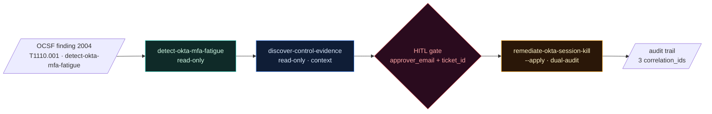

# Skill Composition

The repo's atomic unit is the **skill bundle** (`SKILL.md` + `src/` + `tests/`)
under `skills/<category>/<name>/`. Every shipped skill is one atom: pure
function in, JSONL out, single concern, single contract. That is what makes
the same code run unchanged from CLI, CI, MCP, or a persistent runner.

But a real-world security operation almost never fires one skill in
isolation. Triaging an Okta MFA-fatigue incident pulls a detection, an
evidence query, and a session-kill remediation — three atoms, in order,
across two trust boundaries. This document explains how the repo composes
atoms into runnable workflows without forking the skill model.

Read next:

- [`SKILL_CONTRACT.md`](SKILL_CONTRACT.md) — the atomic skill bar
- [`MCP_AUDIT_CONTRACT.md`](MCP_AUDIT_CONTRACT.md) — what the wrapper
  records on every call
- [`HITL_POLICY.md`](HITL_POLICY.md) — when human approval is required
- [`../examples/workflows/`](../examples/workflows/) — runnable reference
  workflows
- [`../presets/`](../presets/) — named MCP tool allowlists per workflow

## The composition vocabulary

Three things, named:

1. **Atomic skill** — `skills/<category>/<name>/`. The 76 shipped today.
   One concern, one contract, no calls to other skills, no hidden state.
2. **Workflow** — a documented sequence of atomic skills, with explicit
   inputs / outputs / approvals / audit linkage between steps. Lives
   under `examples/workflows/<workflow>.md`.
3. **Preset** — a named MCP tool allowlist (`presets/*.json`) that scopes
   which atomic skills a workflow needs. Operators load a preset into
   `CLOUD_SECURITY_MCP_ALLOWED_SKILLS` so the agent loop can only call the
   atoms the workflow actually authorizes.

There is **no `skills/<x>/<parent>/skills//`** nesting today, and on
purpose. Sub-skill nesting was considered and rejected because it
duplicates what MCP `tools/list` + an allowlist already give you, while
losing the property "every skill is independently runnable from any
surface." Composition lives at the workflow + preset layer; atoms stay
flat.

## Why atoms stay flat

| Approach | Pro | Con |
|---|---|---|
| Nested sub-skills (`skills/parent/skills/child/`) | Hierarchy is visible in the tree | Caller has to import a parent module to invoke a child; cross-cutting helpers fork by parent; MCP allowlist becomes hierarchy-aware |
| Workflow doc + preset (this repo's choice) | Atoms remain composable, each surface still calls them flat, the audit trail joins on `correlation_id` | The hierarchy is in markdown, not the filesystem — discoverability needs the workflow index |

Best agentic practice we explicitly endorse: **composition by transcript,
not inheritance.** An agent that runs three skills produces three audit
records, three `correlation_id`s, three independently-replayable
artifacts. Nothing is hidden inside a "parent" wrapper that swallows the
inner steps.

## Anatomy of a workflow

A workflow document under `examples/workflows/` carries these required
sections, in this order:

1. **Trigger** — the OCSF finding class / CSPM rule / external signal
   that starts the workflow. Concrete (e.g. *Detection Finding 2004 with
   `attacks[].technique.uid == "T1110.001"` and
   `metadata.product.feature.name == "detect-okta-mfa-fatigue"`*).
2. **Required preset** — points at one `presets/*.json`. The MCP-allowlist
   intersection (`process` ∩ `caller` ∩ preset) is what authorizes each
   step.
3. **Steps** — ordered list of atomic skill calls. Each step declares:
   - the skill name
   - the input source (previous step's stdout, or an external fixture)
   - whether the step is read-only or write-capable
   - if write-capable: the HITL gate (which `_approval_context` fields are
     mandatory, and which `min_approvers` count applies)
4. **Audit chain** — the `correlation_id` join across the steps and the
   resulting OCSF Detection Finding lineage that the workflow produces.
5. **Failure modes** — what each step does if the previous one returns
   empty or errored. No silent retries; failures must be explicit.

Workflows are markdown, not code, because the composition logic is
**operator-owned**. An operator could implement the same workflow as a
SOAR playbook, a Step Function, a LangGraph graph, or a manual run-book.
The workflow doc is the spec; each implementation is a transport.

## A worked example

Full text: [`examples/workflows/incident-response-okta-mfa-fatigue.md`](../examples/workflows/incident-response-okta-mfa-fatigue.md).
The matching preset is [`presets/preset-incident-response.json`](../presets/preset-incident-response.json).

## When to compose vs ship a new atomic skill

| Symptom | Right answer |
|---|---|
| You need three known skills run in order, with HITL between them | New workflow doc + preset, no new code |
| You need a transformation step that no atomic skill provides | New atomic skill in the appropriate layer |
| You need state across calls (e.g. dedupe an event seen 5 minutes ago) | Use a runner under `runners/`, not a workflow — runners own state, workflows do not |
| You need to call an atomic skill recursively or in parallel | Use a runner, or implement the orchestration in your agent loop. Workflows are linear by design |

## Best agentic practices we follow

- **Deterministic before LLM-driven.** Every atom is a pure function with
  stable IDs. The LLM picks *which* atom to call (via MCP `tools/list`),
  not *what the atom emits*. Determinism is what makes audits replayable.
- **Allowlist intersection at every layer.** The operator allowlist
  (`CLOUD_SECURITY_MCP_ALLOWED_SKILLS`), the caller allowlist
  (`_caller_context.allowed_skills`), and the workflow preset all
  intersect. The agent can never call an atom outside the smallest of
  the three.
- **HITL belongs to the workflow, not the atom.** Atomic remediation
  skills enforce `min_approvers` on `--apply`, but the *placement* of
  the gate (who approves, when, with what ticket) is the workflow's
  contract.
- **One audit record per atom.** No "workflow-level" rollup that hides
  step failures. The MCP wrapper writes one `mcp_tool_call` per resolved
  atom; the workflow's job is to join them by `correlation_id` after
  the fact, not before.
- **Transcripts are the contract.** A workflow run is reproducible from
  its audit log alone — same inputs, same atoms, same outputs. No hidden
  state inside the agent.

## Authoring checklist

When you add a workflow under `examples/workflows/`:

- [ ] Trigger is OCSF-citable (class, technique, product feature).
- [ ] Required preset exists under `presets/` and lists exactly the atoms
  the workflow uses — no broader.
- [ ] Each write step references its `min_approvers` and the HITL fields
  the workflow expects.
- [ ] Audit chain notes the join key (`correlation_id`) and what
  downstream system stores the joined record.
- [ ] Failure modes are explicit per step.
- [ ] At least one shipped client (a `docs/integrations/*.md` doc, or
  `examples/agents/*.py`) demonstrates running the workflow end-to-end.
