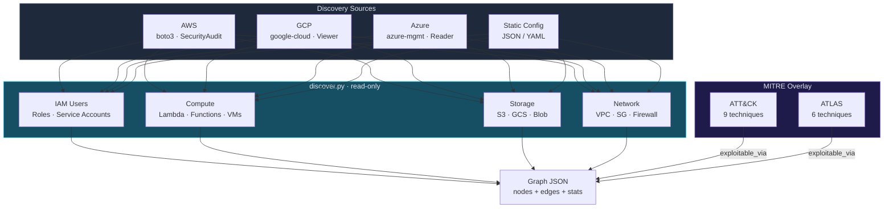

# Cloud Environment Discovery

Maps cloud infrastructure to a security graph with MITRE ATT&CK and ATLAS
technique overlays. Each resource becomes a graph node, each relationship
an edge. Attack techniques are mapped as edges from technique nodes to
vulnerable resources. When an OCSF consumer needs inventory-shaped output, the
same snapshot can be emitted as `Cloud Resources Inventory Info [5023]`.

## When to Use

- Map cloud attack surface before a security assessment
- Visualize IAM → service → storage → network relationships
- Overlay MITRE ATT&CK techniques on infrastructure for threat modeling
- Export cloud inventory as graph JSON for any visualization tool
- Emit an OCSF Discovery bridge event for inventory-oriented pipelines
- Feed into agent-bom's unified graph for cross-platform posture view
- Periodic environment drift detection (compare graph snapshots)

## Architecture



## What Gets Discovered

### AWS (requires boto3 + SecurityAudit policy)

| Resource | Entity Type | MITRE Techniques |
|----------|-------------|-----------------|
| IAM Users | user | T1078.004, T1098.001 |
| IAM Roles | service_account | T1078.004, T1548.005 |
| Access Keys | credential | — |
| S3 Buckets | cloud_resource | T1530, T1537 |
| Lambda Functions | server | T1648, T1195.002 |
| VPCs | cloud_resource | T1599 |
| Security Groups | cloud_resource | T1562.007 |

### GCP (requires google-cloud SDKs + Viewer role)

| Resource | Entity Type |
|----------|-------------|
| Service Accounts | service_account |
| Cloud Storage Buckets | cloud_resource |
| (Extensible for Compute, GKE, Vertex AI) | — |

### Azure (requires azure SDKs + Reader role)

| Resource | Entity Type |
|----------|-------------|
| Resource Groups | cloud_resource |
| Resources (all types) | cloud_resource |
| (Extensible for Entra ID, AKS, AI Studio) | — |

## MITRE ATT&CK Techniques Mapped

| Technique | ID | Resources Affected |
|-----------|-----|-------------------|
| Valid Accounts: Cloud | T1078.004 | IAM users, roles, instances |
| Additional Cloud Credentials | T1098.001 | IAM users |
| Temp Elevated Access | T1548.005 | IAM roles |
| Data from Cloud Storage | T1530 | S3, GCS, Blob |
| Transfer to Cloud Account | T1537 | S3, GCS, Blob |
| Serverless Execution | T1648 | Lambda, Cloud Functions |
| Supply Chain: Software | T1195.002 | Lambda, Cloud Functions |
| Network Boundary Bridging | T1599 | VPCs |
| Impair Cloud Firewall | T1562.007 | Security groups, NSGs |
| Deploy Container | T1610 | EC2, Compute Engine |

## MITRE ATLAS Techniques Mapped

| Technique | ID | Resources Affected |
|-----------|-----|-------------------|
| Inference API Access | AML.T0024 | Model endpoints |
| Denial of ML Service | AML.T0042 | Model endpoints |
| Poison Training Data | AML.T0020 | Training jobs |
| ML Supply Chain | AML.T0010 | Training jobs, model artifacts |
| Exfiltrate Training Data | AML.T0025 | Model artifacts |

## Usage

```bash
# AWS discovery
pip install boto3
python src/discover.py aws --region us-east-1

# AWS with profile
python src/discover.py aws --region us-west-2 --profile production

# GCP discovery
pip install google-cloud-iam google-cloud-storage google-cloud-resource-manager
python src/discover.py gcp --project my-project-id

# Azure discovery
pip install azure-identity azure-mgmt-resource
python src/discover.py azure --subscription-id SUB_ID

# Static config (no SDK needed)
python src/discover.py config --config environment.json

# Save native graph output
python src/discover.py aws -o environment-graph.json

# Emit an OCSF Cloud Resources Inventory bridge event
python src/discover.py aws --output-format ocsf-cloud-resources-inventory -o inventory.ocsf.json
```

## Output Format

Default output is standalone graph JSON — no agent-bom dependency. Any tool can consume it.

```json
{
  "scan_id": "uuid",
  "provider": "aws",
  "region": "us-east-1",
  "discovered_at": "2026-04-09T00:00:00+00:00",
  "nodes": [
    {
      "id": "aws:iam_user:admin",
      "entity_type": "user",
      "label": "admin",
      "attributes": {"arn": "arn:aws:iam::123456789012:user/admin"},
      "compliance_tags": ["MITRE-T1078.004", "MITRE-T1098.001"],
      "dimensions": {"cloud_provider": "aws"}
    }
  ],
  "edges": [
    {
      "source": "mitre:T1078.004",
      "target": "aws:iam_user:admin",
      "relationship": "exploitable_via",
      "evidence": {"technique": "T1078.004", "tactic": "Initial Access"}
    }
  ],
  "stats": {
    "total_nodes": 42,
    "total_edges": 67,
    "node_types": {"user": 5, "service_account": 12, "cloud_resource": 25},
    "relationship_types": {"contains": 30, "owns": 5, "uses": 8, "exploitable_via": 24}
  }
}
```

Optional OCSF bridge output:

```json
{
  "class_uid": 5023,
  "class_name": "Cloud Resources Inventory Info",
  "category_uid": 5,
  "category_name": "Discovery",
  "activity_id": 99,
  "activity_name": "inventory_snapshot",
  "resources": [
    {
      "uid": "aws:s3:prod-bucket",
      "name": "s3://prod-bucket",
      "type": "cloud_resource"
    }
  ],
  "unmapped": {
    "bridge_format": "cloud-security.environment-graph.v1",
    "environment_graph": {}
  }
}
```

## Static Config Format

When cloud SDK access is not available:

```json
{
  "provider": "static",
  "resources": [
    {"id": "vpc-1", "type": "cloud_resource", "name": "Production VPC", "dimensions": {"cloud_provider": "aws"}},
    {"id": "user-1", "type": "iam_user", "name": "deploy-bot"}
  ],
  "relationships": [
    {"source": "vpc-1", "target": "user-1", "type": "contains"}
  ]
}
```

## Security Guardrails

- **Read-only**: Uses SecurityAudit (AWS), Viewer (GCP), Reader (Azure). Zero write permissions.
- **No credentials stored**: Cloud credentials from environment/profile only. Never logged or cached.
- **No data exfiltration**: Graph output stays local. No external API calls beyond cloud SDK.
- **Safe to run in production**: Cannot modify any cloud resources.
- **Idempotent**: Run as often as needed. Snapshot comparison for drift detection.

## Human-in-the-Loop Policy

| Action | Automation Level | Reason |
|--------|-----------------|--------|
| **Discover resources** | Fully automated | Read-only, no side effects |
| **Generate graph JSON** | Fully automated | Local output |
| **Modify IAM/network** | Human required | Infrastructure changes have blast radius |
| **Remediate findings** | Human required | Use iam-departures-aws or hand off to your ticketing workflow |

## Tests

```bash
cd skills/discover-environment
pytest tests/ -v -o "testpaths=tests"
# 15 tests: graph model, MITRE mapping, static config, stats
```
