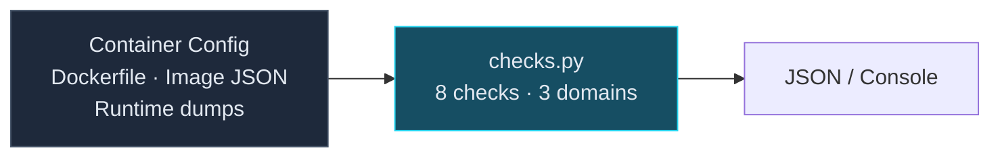

# Container Security Benchmark

8 automated checks across 3 domains — Dockerfile best practices, image
security, and runtime isolation. Each check mapped to CIS Docker Benchmark
and NIST CSF 2.0.

## Architecture



## Controls

| # | Check | Severity | CIS Docker |
|---|-------|----------|-----------|
| CTR-1.1 | No root user | HIGH | 4.1 |
| CTR-1.2 | No :latest base image | MEDIUM | 4.2 |
| CTR-1.3 | HEALTHCHECK defined | LOW | 4.6 |
| CTR-2.1 | No secrets in env vars | CRITICAL | 4.5 |
| CTR-2.2 | Minimal base image | MEDIUM | 4.3 |
| CTR-2.3 | COPY instead of ADD | LOW | 4.9 |
| CTR-3.1 | Read-only root filesystem | MEDIUM | 5.12 |
| CTR-3.2 | Resource limits set | MEDIUM | 5.14 |

## Usage

```bash
python src/checks.py container-config.json
python src/checks.py config.yaml --section dockerfile
python src/checks.py config.json --output json --output-format ocsf
```

## Security Guardrails

- **Read-only**: Analyzes config files. No Docker daemon interaction.
- **No image pulls**: Does not pull, build, or execute container images.
- **Human-in-the-loop**: Assessment automated, Dockerfile changes require human.

## Tests

```bash
cd skills/container-security
pytest tests/ -v -o "testpaths=tests"
```
