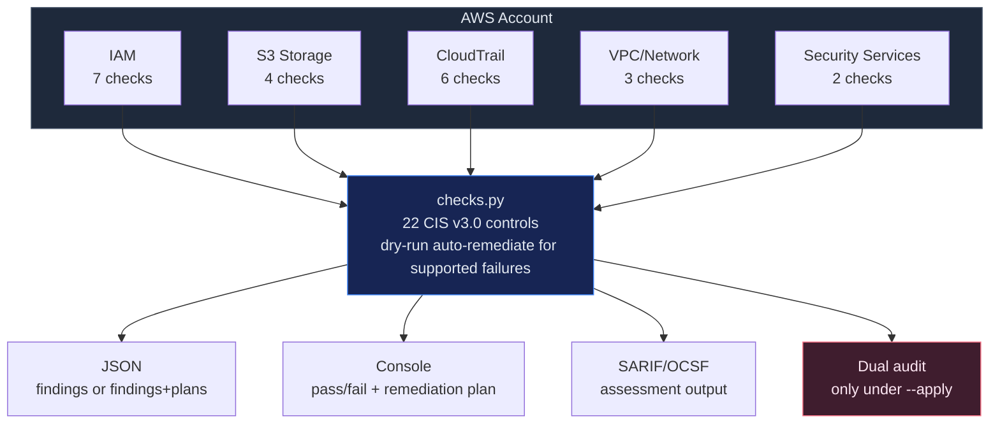

# CSPM — AWS CIS Foundations Benchmark v3.0

Automated assessment of AWS accounts against the CIS AWS Foundations Benchmark v3.0.
22 checks across 5 domains, each mapped to NIST CSF 2.0, ISO 27001:2022, and SOC 2.

## Use when

- Periodic cloud security posture assessment (monthly/quarterly)
- Pre-audit preparation for SOC 2, ISO 27001, or PCI DSS
- Post-incident validation that security controls are intact
- New account baseline — verify guardrails before workloads deploy
- Compliance evidence generation for auditors
- You want dry-run remediation planning for supported AWS CIS failures without leaving the benchmark workflow

## Do NOT use

- For GCP, Azure, or on-prem posture checks
- To bootstrap missing CloudTrail infrastructure or other unsupported controls
- To bypass protected-resource deny-lists for break-glass or intentionally open assets
- To run `--apply` without a declared incident window, approver identity, and explicit confirmation

## Architecture



## Security Guardrails

- **Dry-run by default**: assessment mode stays read-only unless `--auto-remediate --apply` is explicitly requested.
- **Guarded write scope**: the shipped AWS-first slice only supports controls `2.1`, `2.3`, `2.4`, `4.1`, and `4.2`.
- **Protected resources fail closed**: buckets in `CSPM_AWS_AUTOREMEDIATE_PROTECTED_BUCKETS`, security groups in `CSPM_AWS_AUTOREMEDIATE_PROTECTED_SECURITY_GROUPS`, protected tags, and default SGs emit `would-violate-protected-resource` instead of planning/applying.
- **HITL gate**: `--apply` requires `CSPM_AWS_AUTOREMEDIATE_INCIDENT_ID` + `CSPM_AWS_AUTOREMEDIATE_APPROVER` and CLI confirmation.
- **Explicit account boundary**: `--apply` also requires `CSPM_AWS_AUTOREMEDIATE_ALLOWED_ACCOUNT_IDS` to name the current 12-digit AWS account, so ambient credentials cannot silently write to the wrong account.
- **Dual audit**: every apply writes before/after audit rows to DynamoDB + KMS-encrypted S3 via `CSPM_AWS_AUTOREMEDIATE_AUDIT_*` env vars.
- **No credentials stored**: AWS credentials come from environment/instance profile only.
- **No data exfiltration**: results stay local. No external API calls beyond AWS SDK.
- **Safe assessment path**: running without `--auto-remediate --apply` cannot modify any AWS resources.

## Controls — CIS AWS Foundations v3.0 (key controls)

> The full CIS AWS Foundations Benchmark v3.0 has 60+ controls. This skill automates 22 high-signal checks — the ones most frequently flagged in audits and with the highest blast radius if misconfigured.

### Section 1 — IAM (7 checks)

| # | CIS Control | Severity | NIST CSF 2.0 | ISO 27001 |
|---|------------|----------|--------------|-----------|
| 1.1 | MFA on root account | CRITICAL | PR.AC-1 | A.8.5 |
| 1.2 | MFA for console users | HIGH | PR.AC-1 | A.8.5 |
| 1.3 | Credentials unused 45+ days | MEDIUM | PR.AC-1 | A.5.18 |
| 1.4 | Access keys rotated 90 days | MEDIUM | PR.AC-1 | A.5.17 |
| 1.5 | Password policy strength | MEDIUM | PR.AC-1 | A.5.17 |
| 1.6 | No root access keys | CRITICAL | PR.AC-4 | A.8.2 |
| 1.7 | No inline IAM policies | LOW | PR.AC-4 | A.5.15 |

### Section 2 — Storage (4 checks)

| # | CIS Control | Severity | NIST CSF 2.0 | ISO 27001 |
|---|------------|----------|--------------|-----------|
| 2.1 | S3 default encryption | HIGH | PR.DS-1 | A.8.24 |
| 2.2 | S3 server access logging | MEDIUM | DE.AE-3 | A.8.15 |
| 2.3 | S3 public access blocked | CRITICAL | PR.AC-3 | A.8.3 |
| 2.4 | S3 versioning enabled | MEDIUM | PR.DS-1 | A.8.13 |

### Section 3 — Logging (6 checks)

| # | CIS Control | Severity | NIST CSF 2.0 | ISO 27001 |
|---|------------|----------|--------------|-----------|
| 3.1 | CloudTrail multi-region | CRITICAL | DE.AE-3 | A.8.15 |
| 3.2 | CloudTrail log validation | HIGH | PR.DS-6 | A.8.15 |
| 3.3 | CloudTrail S3 not public | CRITICAL | PR.AC-3 | A.8.3 |
| 3.4 | CloudWatch alarms configured | MEDIUM | DE.CM-1 | A.8.16 |
| 3.5 | CloudTrail KMS encryption | MEDIUM | PR.DS-1 | A.8.24 |
| 3.6 | CloudTrail data events | MEDIUM | DE.CM-1 | A.8.15 |

### Section 4 — Networking (3 checks)

| # | CIS Control | Severity | NIST CSF 2.0 | ISO 27001 |
|---|------------|----------|--------------|-----------|
| 4.1 | No unrestricted SSH (0.0.0.0/0:22) | HIGH | PR.AC-5 | A.8.20 |
| 4.2 | No unrestricted RDP (0.0.0.0/0:3389) | HIGH | PR.AC-5 | A.8.20 |
| 4.3 | VPC flow logs enabled | MEDIUM | DE.CM-1 | A.8.16 |

### Section 6 — Security Services (2 checks)

| # | CIS Control | Severity | NIST CSF 2.0 | ISO 27001 |
|---|------------|----------|--------------|-----------|
| 6.1 | GuardDuty enabled | MEDIUM | DE.CM-1 | A.8.16 |
| 6.2 | Security Hub enabled | MEDIUM | DE.CM-1 | A.8.16 |

## Usage

```bash
# Run all checks
python src/checks.py

# Run specific section
python src/checks.py --section iam
python src/checks.py --section storage
python src/checks.py --section logging
python src/checks.py --section networking
python src/checks.py --section security-services

# Output JSON for SIEM/warehouse ingestion
python src/checks.py --output json --output-format ocsf > cis-aws-results.json

# Specific region
python src/checks.py --region us-east-1

# Dry-run remediation plans for supported failures
python src/checks.py --section storage --auto-remediate --output json

# Apply supported remediation actions (CLI-confirmed)
export CSPM_AWS_AUTOREMEDIATE_INCIDENT_ID=INC-2026-04-24-001
export CSPM_AWS_AUTOREMEDIATE_APPROVER=alice@security
export CSPM_AWS_AUTOREMEDIATE_ALLOWED_ACCOUNT_IDS=123456789012
export CSPM_AWS_AUTOREMEDIATE_AUDIT_DYNAMODB_TABLE=cloud-sec-remediation-audit
export CSPM_AWS_AUTOREMEDIATE_AUDIT_BUCKET=cloud-sec-remediation-audit
export CSPM_AWS_AUTOREMEDIATE_AUDIT_KMS_KEY_ARN=arn:aws:kms:us-east-1:123456789012:key/abc123
python src/checks.py --section storage --auto-remediate --apply
```

## Auto-remediation Scope

Supported in this AWS-first slice:

- `2.1` enable bucket default encryption (`put_bucket_encryption`, AES256)
- `2.3` enable full S3 public access block (`put_public_access_block`)
- `2.4` enable bucket versioning (`put_bucket_versioning`)
- `4.1` revoke unrestricted SSH ingress (`revoke_security_group_ingress`)
- `4.2` revoke unrestricted RDP ingress (`revoke_security_group_ingress`)

Not yet supported:

- IAM/user controls like MFA and root-key cleanup
- CloudTrail bootstrap / trail creation / alarm creation
- VPC flow-log provisioning

Under `--output json --auto-remediate`, the skill emits:

- `findings`: the normal benchmark results
- `remediation`: native `remediation_plan` or `remediation_action` records for supported failed controls

## Validate with agent-bom

```bash
# agent-bom has built-in CIS AWS checks — use for continuous monitoring
agent-bom scan --aws --aws-region us-east-1 --aws-cis-benchmark

# Via MCP tool
cis_benchmark(provider="aws", region="us-east-1")
```

## Posture Metrics

| Metric | Target |
|--------|--------|
| CIS Pass Rate | > 90% |
| Critical Findings | 0 |
| IAM MFA Coverage | 100% |
| Stale Access Keys | 0 |
| Public S3 Buckets | 0 |
| CloudTrail Coverage | 100% of regions |
