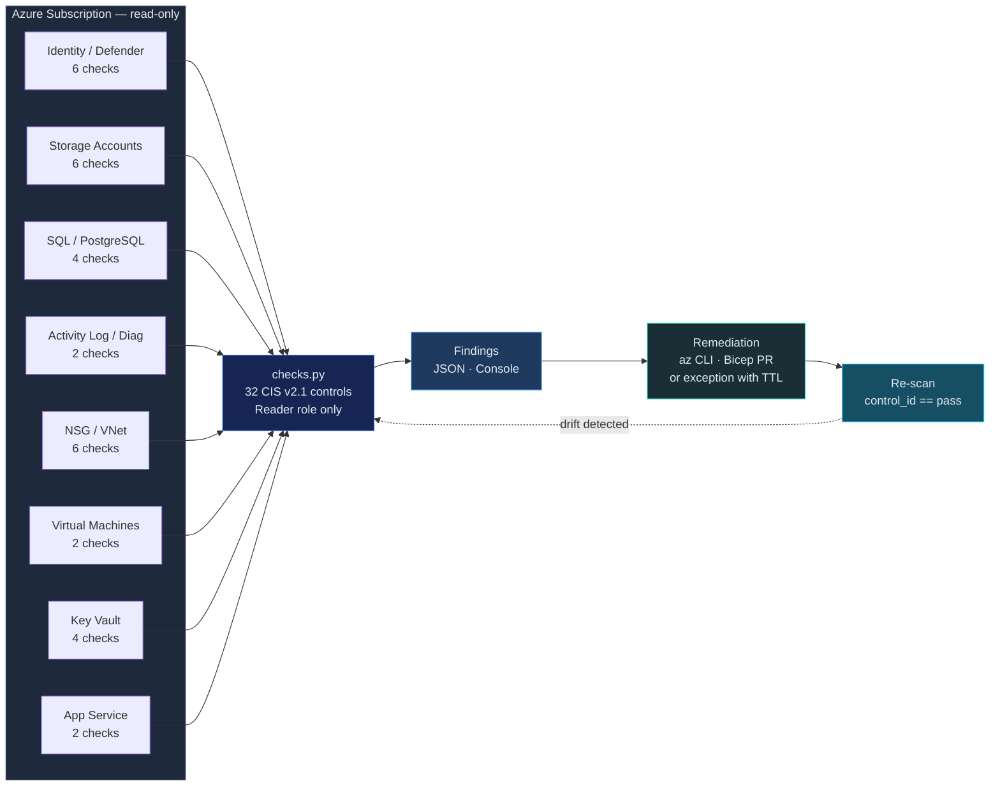

# CSPM — Azure CIS Foundations Benchmark v2.1 (subset)

Automated assessment of Azure subscriptions against CIS Azure Foundations
Benchmark v2.1. This skill implements **32 high-impact checks** (~53% of the
60-control v2.1 benchmark) covering the most common findings on real
subscriptions. Each check is mapped to NIST CSF 2.0.

> **Honest scope:** the table below lists *only* what `src/checks.py` actually
> implements. See the **Roadmap** at the bottom for documented controls that
> are not yet automated. PRs welcome — one check per function, one finding row
> per control.

## When to Use

- Azure subscription security posture assessment
- Pre-audit for SOC 2, ISO 27001, HIPAA
- Azure AI Foundry deployment review
- New subscription baseline validation
- Entra ID hygiene audit

## Architecture

Closed loop: scan → finding → fix (PR or CLI) → re-scan to verify the same `control_id` is now `pass`.



## Security Guardrails

- **Read-only**: Requires `Reader` role only. Zero write permissions.
- **No credentials stored**: Azure credentials from `DefaultAzureCredential` (CLI, managed identity, env).
- **No data exfiltration**: Results stay local. No calls beyond Azure SDK.
- **AI Foundry safe**: Checks managed identity, private endpoints, CMK — does not access model endpoints or data.
- **Idempotent**: Run as often as needed with no side effects.

## Implemented Controls (32 of 60 — 53%)

Each row maps to one function in `src/checks.py`. If it's not in this table, it's not implemented.

### Section 1 — Identity & Access (2 checks)

| # | CIS Control | Function | Severity | NIST CSF 2.0 |
|---|------------|----------|----------|--------------|
| 1.5 | Guest users restricted | `check_1_5_no_guest_users` | MEDIUM | PR.AC-1 |
| 1.21 | No custom subscription-Owner roles | `check_1_21_no_custom_owner_role` | HIGH | PR.AC-4 |

### Section 2 — Defender for Cloud + Storage (8 checks)

| # | CIS Control | Function | Severity | NIST CSF 2.0 |
|---|------------|----------|----------|--------------|
| 2.1 | Storage accounts use customer-managed keys | `check_2_1_storage_cmk` | HIGH | PR.DS-1 |
| 2.1.1 | Defender for Servers enabled | `check_2_1_1_defender_for_servers` | HIGH | DE.CM-1 |
| 2.1.4 | Defender for SQL enabled | `check_2_1_4_defender_for_sql` | HIGH | DE.CM-1 |
| 2.1.14 | Defender for Key Vault enabled | `check_2_1_14_defender_for_key_vault` | MEDIUM | DE.CM-1 |
| 2.1.21 | Defender auto-provisioning enabled | `check_2_1_21_auto_provisioning` | MEDIUM | DE.CM-1 |
| 2.2 | Storage account HTTPS-only | `check_2_2_https_only` | HIGH | PR.DS-2 |
| 2.3 | No public blob access | `check_2_3_no_public_blob` | CRITICAL | PR.AC-3 |
| 2.4 | Storage account network rules (deny by default) | `check_2_4_network_rules` | HIGH | PR.AC-5 |

### Section 3 — Storage extras (2 checks)

| # | CIS Control | Function | Severity | NIST CSF 2.0 |
|---|------------|----------|----------|--------------|
| 3.7 | Storage public network access disabled | `check_3_7_no_public_network_access` | HIGH | PR.AC-3 |
| 3.9 | Blob soft-delete enabled | `check_3_9_blob_soft_delete` | MEDIUM | PR.IP-3 |

### Section 4 — SQL / PostgreSQL + Networking (10 checks)

| # | CIS Control | Function | Severity | NIST CSF 2.0 |
|---|------------|----------|----------|--------------|
| 4.1 | No unrestricted SSH (0.0.0.0/0:22) in NSGs | `check_4_1_no_unrestricted_ssh` | HIGH | PR.AC-5 |
| 4.1.1 | SQL Auditing enabled | `check_4_1_1_sql_auditing` | HIGH | DE.AE-3 |
| 4.1.2 | SQL TDE enabled | `check_4_1_2_sql_tde` | HIGH | PR.DS-1 |
| 4.2 | No unrestricted RDP (0.0.0.0/0:3389) in NSGs | `check_4_2_no_unrestricted_rdp` | HIGH | PR.AC-5 |
| 4.3 | NSG flow logs enabled | `check_4_3_nsg_flow_logs` | MEDIUM | DE.CM-1 |
| 4.4 | Network Watcher in all VNet regions | `check_4_4_network_watcher_regions` | MEDIUM | DE.CM-1 |
| 4.4.1 | PostgreSQL log_checkpoints on | `check_4_4_1_postgres_log_checkpoints` | MEDIUM | DE.AE-3 |
| 4.4.2 | PostgreSQL SSL required | `check_4_4_2_postgres_ssl_required` | HIGH | PR.DS-2 |
| 4.5 | No unrestricted MS-SQL (1433) in NSGs | `check_4_5_no_unrestricted_mssql` | HIGH | PR.AC-5 |
| 4.6 | No unrestricted PostgreSQL (5432) in NSGs | `check_4_6_no_unrestricted_postgres` | MEDIUM | PR.AC-5 |

### Section 5 — Logging & Monitoring (2 checks)

| # | CIS Control | Function | Severity | NIST CSF 2.0 |
|---|------------|----------|----------|--------------|
| 5.1.2 | Activity Log retention >= 365 days | `check_5_1_2_activity_log_retention` | MEDIUM | DE.AE-3 |
| 5.2.1 | Subscription diagnostic settings configured | `check_5_2_1_diagnostic_settings` | MEDIUM | DE.CM-1 |

### Section 7 — Virtual Machines (2 checks)

| # | CIS Control | Function | Severity | NIST CSF 2.0 |
|---|------------|----------|----------|--------------|
| 7.1 | VM OS disk encryption enabled | `check_7_1_vm_os_disk_encryption` | HIGH | PR.DS-1 |
| 7.2 | VM managed disks | `check_7_2_vm_managed_disks` | MEDIUM | PR.DS-1 |

### Section 8 — Key Vault (4 checks)

| # | CIS Control | Function | Severity | NIST CSF 2.0 |
|---|------------|----------|----------|--------------|
| 8.1 | Key Vault soft-delete enabled | `check_8_1_keyvault_soft_delete` | HIGH | PR.IP-3 |
| 8.2 | Key Vault purge protection enabled | `check_8_2_keyvault_purge_protection` | HIGH | PR.IP-3 |
| 8.4 | Key Vault keys have expiration | `check_8_4_keyvault_key_expiration` | MEDIUM | PR.AC-1 |
| 8.5 | Key Vault secrets have expiration | `check_8_5_keyvault_secret_expiration` | MEDIUM | PR.AC-1 |

### Section 9 — App Service (2 checks)

| # | CIS Control | Function | Severity | NIST CSF 2.0 |
|---|------------|----------|----------|--------------|
| 9.1 | App Service HTTPS-only | `check_9_1_appservice_https_only` | HIGH | PR.DS-2 |
| 9.3 | App Service min TLS 1.2+ | `check_9_3_appservice_min_tls` | HIGH | PR.DS-2 |

## Roadmap — Documented but Not Yet Automated

These controls are part of the CIS Azure Foundations v2.1 benchmark but are *not* implemented in `checks.py` yet. PRs welcome.

| Section | Controls | Why it matters |
|---------|---------|----------------|
| 1.x — Identity | MFA, Conditional Access, legacy auth, PIM, security defaults | Requires Microsoft Graph API + Entra ID licensing checks |
| 6.x — Networking | UDR/peering hygiene, private endpoints | `azure-mgmt-network` deeper enumeration |
| AI Foundry | Managed identity, private endpoints, CMK, content safety, diagnostic logging | `azure-mgmt-cognitiveservices` |

## Usage

```bash
# Run all checks
python src/checks.py --subscription-id SUB_ID

# Run specific section (identity, defender, storage, database, logging,
# networking, compute, keyvault, appservice)
python src/checks.py --subscription-id SUB_ID --section storage
python src/checks.py --subscription-id SUB_ID --section keyvault

# Output JSON
python src/checks.py --subscription-id SUB_ID --output json --output-format ocsf > cis-azure-results.json
```

## Remediation — Critical Findings

```
  FINDING: Public blob access enabled (2.3)
  ──────────────────────────────────────────
  FIX:     az storage account update --name ACCOUNT --resource-group RG \
             --allow-blob-public-access false
  VERIFY:  az storage account show --name ACCOUNT --query allowBlobPublicAccess
```

```
  FINDING: AI Foundry endpoint using key auth (A.1)
  ──────────────────────────────────────────────────
  FIX:     az cognitiveservices account update --name ACCOUNT --resource-group RG \
             --disable-local-auth true
  VERIFY:  az cognitiveservices account show --name ACCOUNT --query disableLocalAuth
```

## Posture Metrics

| Metric | Target |
|--------|--------|
| CIS Pass Rate | > 90% |
| MFA Coverage | 100% |
| Public Storage Accounts | 0 |
| NSGs without Flow Logs | 0 |
| AI Endpoints without Private Link | 0 |
| Activity Log Retention | >= 365 days |
