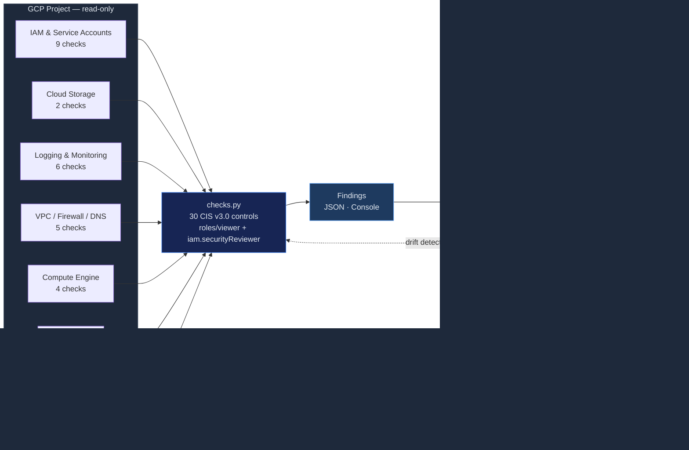

# CSPM — GCP CIS Foundations Benchmark v3.0 (subset)

Automated assessment of GCP projects against a curated subset of CIS GCP
Foundations Benchmark v3.0. The full benchmark has 60+ numbered controls;
this skill implements **30 high-impact checks** that cover the most common
findings on real GCP projects. Each check is mapped to NIST CSF 2.0.

> **Honest scope:** the table below lists *only* what `src/checks.py` actually
> implements. See the **Roadmap** at the bottom for controls that are documented
> by CIS but not yet automated here. Contributions welcome — one check per function,
> one finding row per control.

## Use when

- GCP project security posture assessment
- Pre-audit for SOC 2, ISO 27001, FedRAMP
- New project baseline validation
- Service account key hygiene audit
- Audit logging coverage review

## Architecture

Closed loop: scan → finding → fix (PR or console) → re-scan to verify the same `control_id` is now `pass`.



## Security Guardrails

- **Read-only**: Requires `roles/viewer` + `roles/iam.securityReviewer`. Zero write permissions.
- **No credentials stored**: GCP credentials from ADC (Application Default Credentials) only.
- **No data exfiltration**: Results stay local. No calls beyond GCP SDK.
- **Least privilege**: reads project IAM policy, bucket posture, VPC networks, and subnet attributes only.
- **Idempotent**: Run as often as needed with no side effects.

## Implemented Controls (30)

Each row maps to one function in `src/checks.py`. If it's not in this table, it's not implemented.

### Section 1 — IAM (9 checks)

| # | CIS Control | Function | Severity | NIST CSF 2.0 |
|---|------------|----------|----------|--------------|
| 1.1 | Corporate credentials only (no personal Gmail) | `check_1_1_no_gmail_accounts` | HIGH | PR.AC-1 |
| 1.3 | No user-managed service account keys | `check_1_3_no_sa_keys` | HIGH | PR.AC-1 |
| 1.4 | Service account key rotation (90 days) | `check_1_4_sa_key_rotation` | MEDIUM | PR.AC-1 |
| 1.5 | Separation of duties — no principal holds both `serviceAccountAdmin` and `serviceAccountUser` | `check_1_5_separation_sa_admin` | MEDIUM | PR.AC-4 |
| 1.6 | Org policy `iam.disableServiceAccountKeyCreation` enforced | `check_1_6_disable_sa_key_creation` | MEDIUM | PR.AC-1 |
| 1.11 | Separation of duties on KMS roles (admin vs crypto-key) | `check_1_11_separation_kms` | MEDIUM | PR.AC-4 |
| 1.12 | KMS keys not exposed to `allUsers`/`allAuthenticatedUsers` | `check_1_12_kms_keys_not_public` | CRITICAL | PR.AC-3 |
| 1.13 | API keys carry application + API restrictions | `check_1_13_api_keys_restricted` | MEDIUM | PR.AC-1 |
| 1.14 | Essential Contacts configured (SECURITY/TECHNICAL/LEGAL/SUSPENSION) | `check_1_14_essential_contacts` | LOW | DE.AE-5 |

### Section 2 — Cloud Storage (2 checks)

| # | CIS Control | Function | Severity | NIST CSF 2.0 |
|---|------------|----------|----------|--------------|
| 2.1 | Uniform bucket-level access (no legacy ACL) | `check_2_1_uniform_access` | HIGH | PR.AC-3 |
| 2.3 | No public buckets (allUsers/allAuthenticatedUsers) | `check_2_3_no_public_buckets` | CRITICAL | PR.AC-3 |

### Section 3 — Logging & Monitoring (6 checks)

| # | CIS Control | Function | Severity | NIST CSF 2.0 |
|---|------------|----------|----------|--------------|
| 3.1 | Audit logging on `allServices` for Admin Read, Data Read, and Data Write with no exemptions | `check_3_1_audit_logging_all_services` | HIGH | DE.AE-3 |
| 2.2 | At least one log sink covers all entries (catch-all filter) | `check_2_2_log_sink_configured` | HIGH | DE.AE-3 |
| 2.4 | Log metric filter for project ownership (`SetIamPolicy`) changes | `check_2_4_log_metric_project_ownership` | MEDIUM | DE.AE-3 |
| 2.7 | Log metric filter for VPC network changes | `check_2_7_log_metric_vpc_changes` | MEDIUM | DE.AE-3 |
| 2.10 | Log metric filter for audit-config changes | `check_2_10_log_metric_audit_config` | MEDIUM | DE.AE-3 |
| 2.13 | Cloud Asset Inventory API reachable | `check_2_13_cloud_asset_inventory` | LOW | ID.AM-1 |

### Section 4 — Networking (5 checks)

| # | CIS Control | Function | Severity | NIST CSF 2.0 |
|---|------------|----------|----------|--------------|
| 4.1 | Default VPC deleted | `check_4_1_default_network_deleted` | HIGH | PR.AC-5 |
| 4.2 | No unrestricted SSH/RDP (0.0.0.0/0 on 22/3389) | `check_4_2_no_unrestricted_ssh_rdp` | HIGH | PR.AC-5 |
| 4.3 | VPC flow logs on all subnets | `check_4_3_vpc_flow_logs` | MEDIUM | DE.CM-1 |
| 4.4 | Private Google Access on all subnets | `check_4_4_private_google_access` | MEDIUM | PR.AC-5 |
| 3.10 | Cloud DNS logging enabled on all policies | `check_3_10_dns_logging` | MEDIUM | DE.CM-1 |

### Section 5 — Compute / VM (4 checks)

| # | CIS Control | Function | Severity | NIST CSF 2.0 |
|---|------------|----------|----------|--------------|
| 4.5 | Block project-wide SSH keys on every instance | `check_4_5_block_project_wide_ssh` | MEDIUM | PR.AC-1 |
| 4.6 | Confidential VM enabled | `check_4_6_confidential_vm` | LOW | PR.DS-1 |
| 4.7 | Shielded VM (vTPM + integrity monitoring) | `check_4_7_shielded_vm` | MEDIUM | PR.DS-1 |
| 4.8 | Compute disks encrypted with CMEK | `check_4_8_disk_cmek` | MEDIUM | PR.DS-1 |

### Section 6 — Cloud SQL (2 checks)

| # | CIS Control | Function | Severity | NIST CSF 2.0 |
|---|------------|----------|----------|--------------|
| 6.1 | Cloud SQL instances do not use a public IP | `check_6_1_cloudsql_no_public_ip` | HIGH | PR.AC-5 |
| 6.4 | Cloud SQL instances require SSL | `check_6_4_cloudsql_require_ssl` | HIGH | PR.DS-2 |

### Section 7 — BigQuery (2 checks)

| # | CIS Control | Function | Severity | NIST CSF 2.0 |
|---|------------|----------|----------|--------------|
| 7.1 | BigQuery datasets not exposed to `allUsers`/`allAuthenticatedUsers` | `check_7_1_bigquery_not_public` | CRITICAL | PR.AC-3 |
| 7.2 | BigQuery datasets configured with a default CMEK key | `check_7_2_bigquery_default_cmek` | MEDIUM | PR.DS-1 |

## Roadmap — Documented but Not Yet Automated

These controls are part of the CIS GCP Foundations v3.0 benchmark but are *not* implemented in `checks.py` yet. PRs welcome.

| # | CIS Control | Why it matters |
|---|------------|----------------|
| 1.2 | MFA enforced org-wide | Requires Workspace Admin SDK access, not in this skill's scope |
| 1.7 | SA impersonation scoped | IAM Recommender or policy walker |
| 1.10 | Rotate user-managed SA keys (specialised filter) | Overlaps `check_1_4_sa_key_rotation`; specialise per-key-type later |
| 2.5–2.6, 2.8–2.9, 2.11–2.12 | Additional log metric filters & monitoring alert policies | Requires `google-cloud-monitoring` for AlertPolicy listing |
| 3.3, 3.5, 3.9 | DNSSEC + RSASHA1 + load-balancer logging | Compute API + Cloud DNS deeper coverage |
| 6.2, 6.3, 6.5–6.7 | Cloud SQL trace/binlog/cloud-functions log retention | sqladmin discovery deeper coverage |
| 7.3 | BigQuery dataset audit logging | Cross-cuts with §3.1 audit configs |

## Usage

```bash
# Run all checks
python src/checks.py --project my-project-id

# Run specific section
python src/checks.py --project my-project-id --section iam
python src/checks.py --project my-project-id --section storage
python src/checks.py --project my-project-id --section logging
python src/checks.py --project my-project-id --section networking
python src/checks.py --project my-project-id --section compute
python src/checks.py --project my-project-id --section cloudsql
python src/checks.py --project my-project-id --section bigquery

# Output JSON
python src/checks.py --project my-project-id --output json --output-format ocsf > cis-gcp-results.json
```

## Remediation — Critical Findings

```
  FINDING: Public Cloud Storage bucket (2.3)
  ───────────────────────────────────────────
  FIX:     gsutil iam ch -d allUsers gs://BUCKET
           gsutil iam ch -d allAuthenticatedUsers gs://BUCKET
  VERIFY:  gsutil iam get gs://BUCKET | grep -c "allUsers"  # should be 0
```

```
  FINDING: Audit logging coverage missing on allServices (3.1)
  ───────────────────────────────────────────────────────────
  FIX:     gcloud projects get-iam-policy PROJECT_ID --format=json > policy.json
           # add allServices auditConfigs for ADMIN_READ, DATA_READ, DATA_WRITE
           gcloud projects set-iam-policy PROJECT_ID policy.json
  VERIFY:  python src/checks.py --project PROJECT_ID --section logging
```

## Posture Metrics

| Metric | Target |
|--------|--------|
| CIS Pass Rate | > 90% |
| Service Accounts with User Keys | 0 |
| Public Buckets | 0 |
| Default VPC Present | 0 |
| Subnets without Flow Logs | 0 |
| Subnets without Private Google Access | 0 |
| Audit Logging Coverage | 100% of services |
