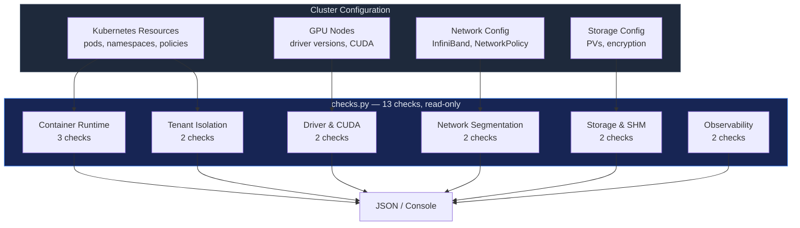

# GPU Cluster Security Benchmark

13 automated checks across 6 domains, auditing the security posture of GPU
compute infrastructure. Each check mapped to MITRE ATT&CK and NIST CSF 2.0,
with explicit MITRE ATLAS and NIST AI RMF coverage for AI infrastructure
runtime, tenancy, storage, and observability safeguards.

No CIS GPU benchmark exists today. This skill fills that gap.

## When to Use

- GPU cluster security hardening before production workloads
- NVIDIA driver CVE assessment across GPU fleet
- Kubernetes GPU namespace isolation audit
- InfiniBand/RDMA tenant segmentation review
- Pre-audit for SOC 2, ISO 27001 with GPU infrastructure
- New GPU cluster baseline validation
- CoreWeave / Lambda Labs / cloud GPU provider security review

## Architecture



## Controls — 6 Domains, 13 Checks

### Section 1 — Container Runtime Isolation (3 checks)

| # | Check | Severity | MITRE ATT&CK | NIST CSF |
|---|-------|----------|-------------|----------|
| GPU-1.1 | No privileged GPU containers | CRITICAL | T1611 | PR.AC-4 |
| GPU-1.2 | GPU via device plugin, not /dev mounts | HIGH | T1611 | PR.AC-4 |
| GPU-1.3 | No host IPC namespace sharing | HIGH | T1610 | PR.AC-4 |

### Section 2 — GPU Driver & CUDA Security (2 checks)

| # | Check | Severity | MITRE ATT&CK | NIST CSF |
|---|-------|----------|-------------|----------|
| GPU-2.1 | GPU driver not in CVE list | CRITICAL | T1203 | ID.RA-1 |
| GPU-2.2 | CUDA >= 12.2 | MEDIUM | — | PR.IP-12 |

### Section 3 — Network Segmentation (2 checks)

| # | Check | Severity | MITRE ATT&CK | NIST CSF |
|---|-------|----------|-------------|----------|
| GPU-3.1 | InfiniBand tenant segmentation | HIGH | T1599 | PR.AC-5 |
| GPU-3.2 | NetworkPolicy on GPU namespaces | HIGH | T1046 | PR.AC-5 |

### Section 4 — Shared Memory & Storage (2 checks)

| # | Check | Severity | NIST CSF |
|---|-------|----------|----------|
| GPU-4.1 | /dev/shm size limits | MEDIUM | PR.DS-4 |
| GPU-4.2 | Model weights encrypted at rest | HIGH | PR.DS-1 |

### Section 5 — Tenant Isolation (2 checks)

| # | Check | Severity | MITRE ATT&CK | NIST CSF |
|---|-------|----------|-------------|----------|
| GPU-5.1 | Namespace isolation per tenant | HIGH | T1078 | PR.AC-4 |
| GPU-5.2 | GPU resource quotas per namespace | MEDIUM | — | PR.DS-4 |

### Section 6 — Observability (2 checks)

| # | Check | Severity | MITRE ATT&CK | NIST CSF |
|---|-------|----------|-------------|----------|
| GPU-6.1 | DCGM/GPU monitoring enabled | MEDIUM | — | DE.CM-1 |
| GPU-6.2 | GPU workload audit logging | HIGH | T1562.002 | DE.AE-3 |

## Usage

```bash
# Run all checks
python src/checks.py cluster-config.json

# Run specific section
python src/checks.py config.yaml --section runtime
python src/checks.py config.yaml --section driver
python src/checks.py config.yaml --section tenant

# JSON output
python src/checks.py config.json --output json --output-format ocsf > gpu-security-results.json
```

## Config Format

```yaml
pods:
  - name: "training-a100"
    security_context:
      privileged: false
      runAsNonRoot: true
      readOnlyRootFilesystem: true
    resources:
      limits:
        nvidia.com/gpu: 8
    volumes:
      - name: dshm
        emptyDir: { medium: Memory, sizeLimit: "8Gi" }

nodes:
  - name: "gpu-node-01"
    driver_version: "550.54.14"
    cuda_version: "12.4"

network:
  infiniband:
    partitions: ["tenant-a-pkey", "tenant-b-pkey"]
    tenant_isolation: true

namespaces:
  - name: "tenant-a-gpu"
    network_policies: [{ name: "default-deny" }]
    resource_quota: { "nvidia.com/gpu": 8 }

storage:
  encryption_at_rest: true
  volumes:
    - name: "model-weights"
      encrypted: true

monitoring:
  dcgm: true

logging:
  gpu_workloads: true
```

## Security Guardrails

- **Read-only**: Parses config files only. Zero API calls. Zero network access. Zero write operations.
- **No GPU access**: Does not interact with GPU hardware, drivers, or CUDA runtime.
- **Safe to run in CI/CD**: Exit code 0 = pass, 1 = critical/high failures.
- **Idempotent**: Run as often as needed with no side effects.
- **No cloud SDK required**: Works with exported Kubernetes resources or hand-written configs.

## Human-in-the-Loop Policy

| Action | Automation Level | Reason |
|--------|-----------------|--------|
| **Run checks** | Fully automated | Read-only config assessment |
| **Generate report** | Fully automated | Output to console/JSON |
| **Upgrade GPU drivers** | Human required | Driver upgrades require node cordoning + reboot |
| **Apply NetworkPolicy** | Human required | Network changes can break GPU training jobs |
| **Modify IB partitions** | Human required | InfiniBand reconfiguration affects all tenants |
| **Enable encryption** | Human required | Requires volume migration + key management |

## MITRE ATT&CK Coverage

| Technique | ID | How This Skill Detects It |
|-----------|-----|--------------------------|
| Container Escape | T1611 | Checks privileged mode, device mounts, host IPC |
| Exploitation via Driver | T1203 | Checks driver version against known CVE list |
| Network Sniffing | T1046 | Checks NetworkPolicy on GPU namespaces |
| Network Boundary Bypass | T1599 | Checks InfiniBand tenant segmentation |
| Valid Accounts | T1078 | Checks namespace isolation per tenant |
| Impair Defenses: Logging | T1562.002 | Checks GPU workload audit logging |
| Data from Storage | T1530 | Checks model weight encryption |

## MITRE ATLAS and NIST AI RMF Coverage

This skill does **not** invent fake per-check ATLAS technique IDs where the fit
is weak. Instead, it declares explicit framework depth for the AI
infrastructure domains the benchmark covers today:

| Domain | MITRE ATLAS focus | NIST AI RMF focus |
|---|---|---|
| Runtime isolation | hardening AI workload execution on GPU clusters | MANAGE, GOVERN |
| Driver security | vulnerable GPU dependency and compute integrity exposure | MEASURE, MANAGE |
| Network segmentation | tenant boundary protection for AI infrastructure traffic | MAP, MANAGE |
| Storage and model artifacts | model/artifact protection against unauthorized access | MAP, MANAGE |
| Tenant isolation and quotas | controls against account and cost abuse on shared GPU fleets | GOVERN, MANAGE |
| Observability | detection and investigation support for AI infrastructure misuse | MEASURE, MANAGE |

That keeps the framework claims explicit and testable today while leaving
technique-by-technique ATLAS expansion as a roadmap item.

## Known Vulnerable NVIDIA Drivers

| Driver Version | CVE | Impact |
|---------------|-----|--------|
| 535.129.03 | CVE-2024-0074 | Code execution |
| 535.104.05 | CVE-2024-0074 | Code execution |
| 530.30.02 | CVE-2023-31018 | Denial of service |
| 525.60.13 | CVE-2023-25516 | Information disclosure |
| 515.76 | CVE-2022-42263 | Buffer overflow |
| 510.47.03 | CVE-2022-28183 | Out-of-bounds read |

## Tests

```bash
cd skills/gpu-cluster-security
pytest tests/ -v -o "testpaths=tests"
# 31 tests covering all 13 checks + runner + compliance mappings
```
