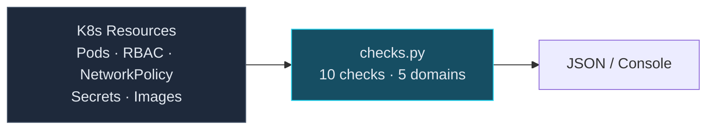

# Kubernetes Security Benchmark

10 automated checks across 5 domains — pod security, RBAC, network policies,
secrets, and image management. Each check mapped to CIS Kubernetes Benchmark
and NIST CSF 2.0.

## Architecture



## Controls

| # | Check | Severity | CIS K8s |
|---|-------|----------|---------|
| K8S-1.1 | No privileged pods | CRITICAL | 5.2.1 |
| K8S-1.2 | No host PID namespace | HIGH | 5.2.2 |
| K8S-1.3 | No host network | HIGH | 5.2.4 |
| K8S-1.4 | Drop ALL capabilities | MEDIUM | 5.2.7 |
| K8S-2.1 | No cluster-admin on default SA | CRITICAL | 5.1.1 |
| K8S-2.2 | No wildcard RBAC permissions | HIGH | 5.1.3 |
| K8S-3.1 | Default deny NetworkPolicy | HIGH | 5.3.2 |
| K8S-4.1 | Secrets not via env vars | MEDIUM | 5.4.1 |
| K8S-4.2 | Secrets encrypted at rest | HIGH | 5.4.2 |
| K8S-5.1 | No :latest image tags | MEDIUM | 5.5.1 |

## Usage

```bash
python src/checks.py cluster-config.json
python src/checks.py config.yaml --section pod_security
python src/checks.py config.json --output json --output-format ocsf
```

## Security Guardrails

- **Read-only**: Analyzes exported configs. No kubectl write commands.
- **No cluster access required**: Works with JSON/YAML dumps.
- **Human-in-the-loop**: Assessment automated, remediation requires human.

## Tests

```bash
cd skills/k8s-security-benchmark
pytest tests/ -v -o "testpaths=tests"
```
