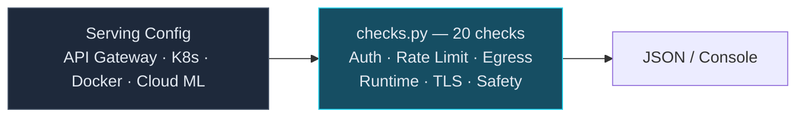

# Model Serving Security Benchmark

20 automated checks across 6 domains, auditing the security posture of AI model
serving infrastructure. Each check is mapped to MITRE ATLAS, NIST CSF 2.0, and
an explicit NIST AI RMF 1.0 function scope.

## When to Use

- Pre-deployment security review of model serving infrastructure
- Audit API gateway and endpoint configurations
- Validate content safety and prompt injection defenses
- Container security posture check for model serving pods
- Compliance evidence for SOC 2, ISO 27001 audits
- Periodic model serving infrastructure hygiene assessment

## Architecture



## Controls — 6 Domains, 16 Checks

### Section 1 — Authentication & Authorization (4 checks)

| # | Check | Severity | MITRE ATLAS | NIST CSF |
|---|-------|----------|-------------|----------|
| MS-1.1 | Endpoint authentication required | CRITICAL | AML.T0024 | PR.AC-1 |
| MS-1.2 | No hardcoded API keys in config | CRITICAL | AML.T0024 | PR.AC-4 |
| MS-1.3 | RBAC on model endpoints | HIGH | AML.T0024 | PR.AC-4 |
| MS-1.4 | Managed identity or workload identity on endpoints | HIGH | AML.T0024 | PR.AC-4 |

### Section 2 — Rate Limiting & Abuse Prevention (2 checks)

| # | Check | Severity | MITRE ATLAS | NIST CSF |
|---|-------|----------|-------------|----------|
| MS-2.1 | Rate limiting on inference endpoints | HIGH | AML.T0042 | PR.DS-4 |
| MS-2.2 | Input size/token limits | MEDIUM | AML.T0042 | PR.DS-4 |

### Section 3 — Data Egress & Privacy (3 checks)

| # | Check | Severity | MITRE ATLAS | NIST CSF |
|---|-------|----------|-------------|----------|
| MS-3.1 | Output content filtering | HIGH | AML.T0048.002 | PR.DS-5 |
| MS-3.2 | Training data memorization guard | HIGH | AML.T0025 | PR.DS-5 |
| MS-3.3 | PII redaction in logs | HIGH | AML.T0025 | PR.DS-5 |

### Section 4 — Container & Runtime Isolation (3 checks)

| # | Check | Severity | MITRE ATLAS | NIST CSF |
|---|-------|----------|-------------|----------|
| MS-4.1 | No privileged containers | CRITICAL | AML.T0011 | PR.AC-4 |
| MS-4.2 | Read-only root filesystem | MEDIUM | AML.T0011 | PR.DS-6 |
| MS-4.3 | Non-root container user | HIGH | AML.T0011 | PR.AC-4 |

### Section 5 — TLS & Network (3 checks)

| # | Check | Severity | NIST CSF |
|---|-------|----------|----------|
| MS-5.1 | TLS enforced on all endpoints | CRITICAL | PR.DS-2 |
| MS-5.2 | No public model endpoints | HIGH | PR.AC-5 |
| MS-5.3 | Private network isolation on endpoints | HIGH | AML.T0024 | PR.AC-5 |

### Section 6 — Safety Layers (5 checks)

| # | Check | Severity | MITRE ATLAS | NIST CSF |
|---|-------|----------|-------------|----------|
| MS-6.1 | Prompt injection detection | HIGH | AML.T0051 | DE.CM-4 |
| MS-6.2 | Content safety classification | HIGH | AML.T0048 | DE.CM-4 |
| MS-6.3 | Model version tracking | MEDIUM | AML.T0010 | PR.DS-6 |
| MS-6.4 | Guardrails attached to AI endpoints | HIGH | AML.T0048 | DE.CM-4 |
| MS-6.5 | Audit logging on AI endpoints | MEDIUM | AML.T0010 | DE.CM-3 |

## Usage

```bash
# Run all checks against a serving config
python src/checks.py serving-config.json

# Run specific section
python src/checks.py config.yaml --section auth
python src/checks.py config.yaml --section safety

# JSON output for pipeline integration
python src/checks.py config.json --output json --output-format ocsf > results.json

# Scan additional paths for hardcoded secrets
python src/checks.py config.yaml --scan-paths ./k8s/ ./helm/
```

## Config Format

The benchmark accepts any JSON or YAML file with these top-level keys (all optional):

```yaml
endpoints:
  - name: "inference"
    url: "https://model.internal:8443"
    auth: { type: "api_key", roles: ["admin", "user"] }
    rate_limit: { rpm: 100 }
    limits: { max_tokens: 4096 }
    tls: { enabled: true }
    network: { vpc: true }

containers:
  - name: "model-server"
    security_context:
      privileged: false
      readOnlyRootFilesystem: true
      runAsNonRoot: true
      runAsUser: 1000

safety:
  prompt_injection: true
  content_classification: true
  output_filter: true
  categories: ["violence", "hate", "self-harm"]

privacy:
  memorization_guard: true

logging:
  log_requests: true
  redact_pii: true

models:
  - name: "claude-3.5-sonnet"
    version: "20241022"

aws:
  sagemaker:
    endpoints:
      - EndpointName: fraud-endpoint
        ExecutionRoleArn: arn:aws:iam::123456789012:role/sagemaker-runtime
        VpcConfig: { Subnets: ["subnet-123"] }
        DataCaptureConfig: { EnableCapture: true }
  bedrock:
    guardrails:
      - id: guardrail-1

gcp:
  vertex_ai:
    endpoints:
      - name: projects/p/locations/us-central1/endpoints/1
        displayName: fraud-endpoint
        serviceAccount: svc@example.iam.gserviceaccount.com
        privateServiceConnectConfig: { enablePrivateServiceConnect: true }
        safetySettings: [{ category: HARM_CATEGORY_HATE_SPEECH }]

azure:
  azure_ml:
    online_endpoints:
      - name: fraud-endpoint
        auth_mode: aad_token
        identity: { type: SystemAssigned }
        private_endpoint: true
        app_insights_enabled: true
```

## Security Guardrails

- **Read-only**: Parses config files only. Zero API calls. Zero network access. Zero write operations.
- **No credentials accessed**: Detects hardcoded secrets by pattern matching — never extracts or stores them.
- **Safe to run in CI/CD**: Exit code 0 = pass, 1 = critical/high failures found.
- **Idempotent**: Run as often as needed with no side effects.
- **No cloud SDK required**: Works with local config files from any provider.

## Human-in-the-Loop Policy

| Action | Automation Level | Reason |
|--------|-----------------|--------|
| **Run checks** | Fully automated | Read-only assessment, no side effects |
| **Generate report** | Fully automated | Output to console/JSON/SARIF |
| **Apply remediation** | Human required | Config changes need review + testing |
| **Rotate credentials** | Human required | Credential rotation has blast radius |
| **Modify safety layers** | Human required | Safety config changes affect model behavior |

## MITRE ATLAS Coverage

| Technique | ID | How This Skill Detects It |
|-----------|-----|--------------------------|
| Inference API Access | AML.T0024 | Checks auth, RBAC, network exposure |
| Denial of ML Service | AML.T0042 | Checks rate limiting, input size limits |
| Prompt Injection | AML.T0051 | Checks injection guard configuration |
| Output Integrity Attack | AML.T0048 | Checks content filtering, safety layers |
| Training Data Extraction | AML.T0025 | Checks memorization guard, PII redaction |
| Model Poisoning | AML.T0010 | Checks model version pinning |
| Exploit Public ML App | AML.T0011 | Checks container isolation, non-root |

## Tests

```bash
cd skills/model-serving-security
pytest tests/ -v -o "testpaths=tests"
# focused tests cover the provider-shaped endpoint paths and all 20 checks
```
