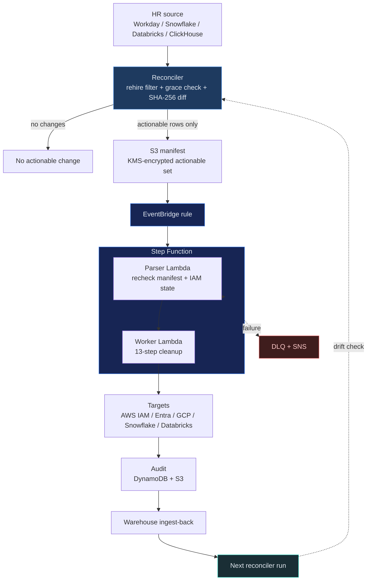

# IAM Departures Remediation

Automated IAM cleanup for departed employees with rehire-safe logic, change-driven
exports, and an AWS-native EventBridge -> Step Function -> 2-Lambda remediation
pipeline.

Read [reference.md](reference.md) for detailed architecture, framework mappings,
IAM role ARN definitions, and security model. Read [examples.md](examples.md)
for deployment walkthroughs and usage scenarios.

## When to Use

- An employee is terminated and their AWS IAM user should be cleaned up
- Bulk offboarding after a layoff or reorganization
- Audit identifies stale IAM users tied to departed employees
- Compliance requires automated deprovisioning (SOC 2 CC6.3, CIS 5.3, NIST PR.AC-1)
- Security team wants to eliminate T1078.004 (Valid Accounts: Cloud Accounts) risk

## Pipeline Overview



## Security Guardrails

- **Dry-run first**: use the parser Lambda and AWS worker Lambda dry-run paths before any real execution. Planning, examples, and validation should never start with a destructive path.
- **Deny policies**: Root, `break-glass-*`, and `emergency-*` accounts are protected by explicit IAM deny — the pipeline cannot touch them.
- **Grace period**: 7-day default window before remediation (configurable). HR corrections within this window prevent accidental deletion.
- **Rehire safety**: 8 scenarios handled. The reconciler/export path applies the primary rehire-aware `should_remediate()` filter before writing the S3 manifest; the parser Lambda rechecks before worker execution.
- **Cross-account scoped**: STS AssumeRole limited by `aws:PrincipalOrgID` condition — cannot escape the AWS Organization.
- **Encryption**: S3 manifests KMS-encrypted. DynamoDB encryption at rest. Lambda env vars encrypted.
- **VPC isolation**: Both Lambdas run in VPC with no public internet (NAT gateway for AWS API calls only).
- **Audit trail**: Every action dual-written to DynamoDB + S3. Ingest-back to source warehouse for reconciliation.

## Do NOT do

- Do NOT bypass the grace period by editing timestamps or manifest state by hand.
- Do NOT call the Step Function or worker Lambda directly; enter through the documented EventBridge path.
- Do NOT write directly to the audit DynamoDB or S3 records outside the shipped workflow.
- Do NOT point this skill at production without a dry-run review and explicit human approval.

## Rehire Safety

The pipeline handles 8 rehire scenarios. Key rules:

1. **Rehired + same IAM in use** → SKIP (employee is active)
2. **Rehired + old IAM idle** → REMEDIATE (orphaned credential)
3. **IAM already deleted** → SKIP (no-op)
4. **Within grace period** → SKIP (HR correction window, default 7 days)
5. **Terminated again after rehire** → REMEDIATE

See [`../../discovery/iam-departures-reconciler/src/reconciler/sources.py`](../../discovery/iam-departures-reconciler/src/reconciler/sources.py)
for `DepartureRecord.should_remediate()` and the complete decision tree.

The parser Lambda is intentionally a second safety gate, not the first place
rehire decisions are made.

## IAM Deletion Order

AWS requires all dependencies removed before `iam:DeleteUser`. The worker
Lambda executes 13 steps in strict order:

1. Deactivate access keys
2. Delete access keys
3. Delete login profile (console access)
4. Remove from all groups
5. Detach all managed policies
6. Delete all inline policies
7. Deactivate MFA devices
8. Delete virtual MFA devices
9. Delete signing certificates
10. Delete SSH public keys
11. Delete service-specific credentials
12. Tag user with audit metadata
13. **Delete IAM user**

## AWS IAM Roles Required

Every component needs an IAM execution role. See [reference.md](reference.md)
for full policy documents and [infra/cloudformation.yaml](infra/cloudformation.yaml)
for deployable templates.

| Component | Role | Key Permissions |
|-----------|------|-----------------|
| Lambda 1 (Parser) | `iam-departures-parser-role` | `s3:GetObject`, `sts:AssumeRole`, `iam:GetUser` |
| Lambda 2 (Worker) | `iam-departures-worker-role` | Full IAM remediation, DynamoDB, S3, KMS |
| Step Function | `iam-departures-sfn-role` | `lambda:InvokeFunction` on both Lambdas |
| EventBridge | `iam-departures-events-role` | `states:StartExecution` on the Step Function |
| S3 Bucket | Bucket policy | Restrict to Security OU account only |
| Cross-Account | `iam-remediation-role` | IAM read/write in target accounts (StackSets) |
| DLQ | `iam-departures-dlq` (SQS) | Captures Lambda async failures for replay (KMS encrypted) |
| Alerts | `iam-departures-alerts` (SNS) | EventBridge fires on `Step Functions Execution Status Change` for `FAILED` / `TIMED_OUT` / `ABORTED` |

## Cross-cloud workflow shape

The shipped flagship control plane is AWS-native:

- reconciler writes the actionable manifest to S3
- EventBridge starts the Step Function
- the Step Function invokes parser and worker Lambdas
- audit artifacts land in DynamoDB + S3 and then ingest back into the warehouse

Equivalent GCP or Azure workflows should keep the same guardrails and skill
contract, but use native services for those clouds rather than pretending one
orchestration stack fits every provider.

## Data Sources

Configure one HR data source via environment variables. These variable names are
the runtime interface, not the recommended storage mechanism. In production,
inject them from AWS Secrets Manager, SSM Parameter Store, Vault, workload
identity, or an equivalent secret store.

This skill is secret-minimizing, not password-free. Prefer workload identity,
storage integrations, or short-lived scoped tokens where the platform supports
them. The remaining password and client-secret paths below are supported for
vendor compatibility and should be treated as secret material: never log them,
persist them in audit rows, or store them in source-controlled config.

| Source | Required Env Vars |
|--------|-------------------|
| Snowflake | `SNOWFLAKE_ACCOUNT`, `SNOWFLAKE_USER`, `SNOWFLAKE_PASSWORD` |
| Snowflake (Storage Integration) | `SNOWFLAKE_ACCOUNT`, `SNOWFLAKE_STORAGE_INTEGRATION` |
| Databricks | `DATABRICKS_HOST`, `DATABRICKS_TOKEN` |
| ClickHouse | `CLICKHOUSE_HOST`, `CLICKHOUSE_USER`, `CLICKHOUSE_PASSWORD` |
| Workday API | `WORKDAY_API_URL`, `WORKDAY_CLIENT_ID`, `WORKDAY_CLIENT_SECRET` |

Prefer the storage-integration or federation path where the source platform supports it. Use direct password or client-secret auth only when the source platform does not expose a stronger operational path in your environment.

## Security Principles

- **Least privilege**: Each role has only the permissions it needs
- **Defense in depth**: Deny policies on protected users (root, break-glass-*, emergency-*)
- **Scoped cross-account trust**: Cross-account access is gated by `aws:PrincipalOrgID`, so role assumption fails from outside the organization even if a role ARN is leaked
- **Encryption**: S3 KMS, DynamoDB encryption at rest, Lambda env var encryption
- **Audit trail**: Dual-write to DynamoDB + S3, ingest-back to source warehouse
- **Deployment**: All infra in Organization Security OU management account

## Project Structure

```
skills/remediation/iam-departures-aws/
├── SKILL.md                    # This file (skill definition)
├── reference.md                # Detailed architecture + framework mappings
├── examples.md                 # Deployment walkthroughs
├── src/
│   ├── ../discovery/iam-departures-reconciler/
│   │   ├── src/reconciler/     # Shared planner modules
│   │   ├── src/discover.py     # Read-only manifest builder
│   │   └── tests/              # Reconciler regression suite
│   ├── lambda_parser/
│   │   └── handler.py          # Lambda 1: validate + filter
│   └── lambda_worker/
│       ├── handler.py          # Lambda 2: AWS 13-step cleanup
│       └── clouds/             # Cross-cloud workers
│           ├── azure_entra.py  # Entra ID: 6-step (msgraph-sdk)
│           ├── gcp_iam.py      # GCP: SA 4-step + Workspace 2-step
│           ├── snowflake_user.py # Snowflake: 6-step (SQL DDL)
│           └── databricks_scim.py # Databricks: 4-step (SCIM API)
├── infra/
│   ├── cloudformation.yaml     # Full stack (roles, Lambda, SFN, S3, DDB)
│   ├── cross_account_stackset.yaml # Org-wide role via StackSets
│   ├── step_function.asl.json  # ASL definition
│   ├── eventbridge_rule.json   # S3 trigger
│   ├── snowflake_integration.sql
│   └── iam_policies/           # Individual policy documents
└── tests/                      # AWS parser/worker regression tests
```

## Deployment Options

Deploy with CloudFormation or Terraform — both produce identical infrastructure:

```bash
# CloudFormation
aws cloudformation deploy \
  --template-file infra/cloudformation.yaml \
  --stack-name iam-departures-aws \
  --capabilities CAPABILITY_NAMED_IAM \
  --parameter-overrides OrgId=o-abc123def4 ...

# Terraform
cd infra/terraform
cp terraform.tfvars.example terraform.tfvars  # edit with your values
terraform init && terraform plan && terraform apply
```

| IaC | Path | Resources |
|-----|------|-----------|
| CloudFormation | `infra/cloudformation.yaml` | Full stack (S3, KMS, DDB, Lambda, SFN, EventBridge, DLQ, SNS alerts, 4 IAM roles) |
| Terraform | `infra/terraform/main.tf` | Same resources, HCL format |
| StackSets | `infra/cross_account_stackset.yaml` | Org-wide cross-account remediation role |

## MITRE ATT&CK Coverage

| Technique | ID | How This Skill Addresses It |
|-----------|-----|---------------------------|
| Valid Accounts: Cloud | T1078.004 | Daily reconciliation detects + remediates |
| Additional Cloud Creds | T1098.001 | All access keys deactivated + deleted |
| Cloud Account Discovery | T1087.004 | Cross-account STS validates IAM existence |
| Account Access Removal | T1531 | Full dependency cleanup pipeline |
| Unsecured Credentials | T1552 | Proactive cleanup within grace period |

## CIS Benchmark Cross-Reference

This skill directly remediates findings flagged by CIS benchmarks:

| CIS Control | Benchmark | What This Skill Remediates |
|------------|-----------|---------------------------|
| 1.3 — Credentials unused 45+ days | CIS AWS v3.0 | Deletes departed-employee access keys + console access |
| 1.4 — Access keys rotated 90 days | CIS AWS v3.0 | Removes keys entirely (stronger than rotation) |
| 5.3 — Disable/remove unused accounts | CIS Controls v8 | Full 13-step cleanup + deletion |
| 6.1 — Establish access granting process | CIS Controls v8 | Automated deprovisioning tied to HR data |
| 6.2 — Establish access revoking process | CIS Controls v8 | Event-driven pipeline, < 24h from termination |
| 6.5 — Require MFA | CIS Controls v8 | Deactivates + deletes orphaned MFA devices |

> **Workflow**: Run `cspm-aws-cis-benchmark` to identify stale credentials → this skill automatically remediates them. The two skills work together — detection + response.
