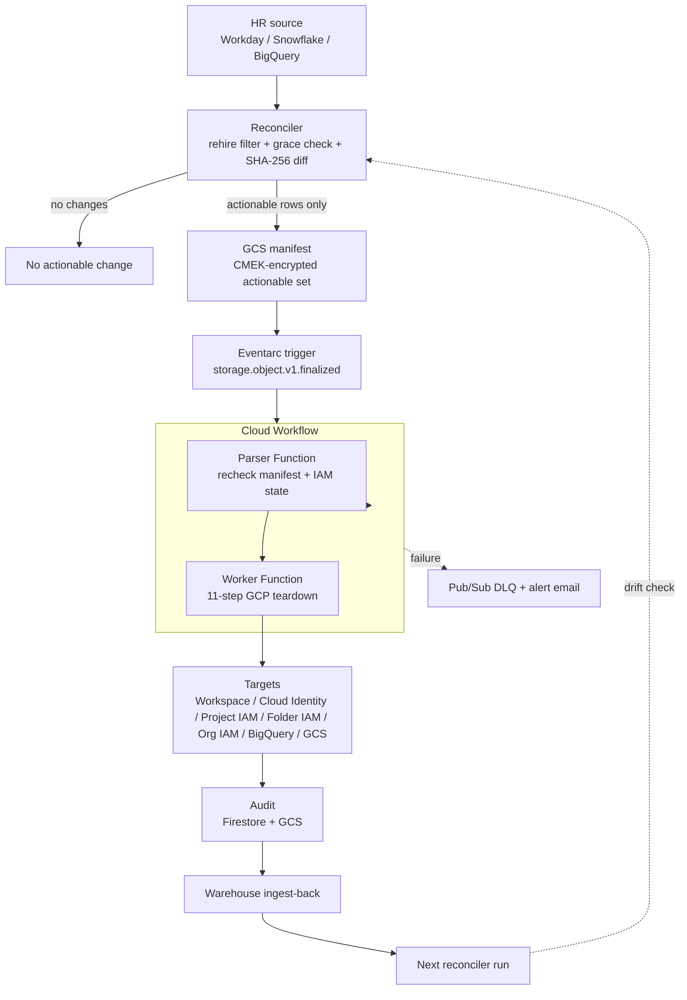

# iam-departures-gcp

GCP counterpart to the flagship [`iam-departures-aws`](../iam-departures-aws/) skill.
Closes [#239](https://github.com/msaad00/cloud-ai-security-skills/issues/239).

Same closed loop: HR source → manifest in GCS → Eventarc → Cloud Workflow →
parser Cloud Function → fan-out to worker Cloud Function → 11-step IAM
teardown → dual audit (Firestore + KMS-encrypted GCS) → ingest-back to the
warehouse so the next reconciler run proves the user is closed across all
GCP surfaces (Workspace, Cloud Identity, project IAM, folder IAM, org IAM,
BigQuery, GCS).

This skill is the GCP-native replica of the AWS pipeline. It uses GCP services,
not adaptations:

| AWS | GCP equivalent |
|---|---|
| Lambda (parser, worker) | Cloud Functions Gen 2 (Python 3.11) |
| Step Functions | Cloud Workflows |
| EventBridge on S3 PutObject | Eventarc on GCS `google.cloud.storage.object.v1.finalized` |
| DynamoDB audit table | Firestore (Native mode) collection |
| KMS-encrypted S3 evidence | KMS-encrypted GCS evidence object |
| `sts:AssumeRole` + `aws:PrincipalOrgID` | IAM Conditions binding worker SA to the org/folder |
| StackSets cross-account role | Resource Manager IAM bindings on the worker SA at org/folder scope |

## When to use

- A GCP/Workspace employee or contractor is terminated and needs a clean offboard across Workspace, all GCP projects in the org, BigQuery datasets, and GCS buckets.
- A service account belongs to a terminated employee and needs to be retired without breaking active workloads.
- Audit identifies stale Workspace users or SAs tied to departed employees.
- Compliance requires automated deprovisioning (SOC 2 CC6.3, CIS GCP 1.5/1.7, NIST PR.AC-1).
- Security team wants to eliminate T1078.004 (Valid Accounts: Cloud Accounts) risk on GCP.

## Pipeline overview



## Do NOT use

- For AWS IAM cleanup — use [`iam-departures-aws`](../iam-departures-aws/).
- For Azure Entra service-principal containment — use [`remediate-entra-credential-revoke`](../remediate-entra-credential-revoke/).
- For Snowflake user offboarding (covered by the AWS skill's `clouds/snowflake_user.py` library module today; per-cloud GCP→Snowflake is out of scope).
- For Okta session containment — use [`remediate-okta-session-kill`](../remediate-okta-session-kill/).
- To bypass the grace period or set it to 0 "to test" — the parser refuses.
- To call the worker Cloud Function directly without the Workflow — bypasses the audit dual-write.
- To extend the protected-principal deny list at runtime — the list is mirrored in IaC.
- For access provisioning. This skill only revokes.

## Security guardrails

- **Dry-run first**: parser and worker both honour `dry_run=True`; the worker emits `RemediationStatus.DRY_RUN` with the full step list and zero API calls.
- **Protected-principal deny list**: `super-admin*`, `break-glass-*`, `emergency-*` Workspace users; service accounts whose name starts with `terraform-`, `cd-`, or `org-admin-`. Mirrored in code (`steps.is_protected_principal`) and in the cross-project IAM Condition bound to the worker service account.
- **Grace period**: 7 days default before remediation. Configurable (`IAM_DEPARTURES_GCP_GRACE_DAYS`) but the parser refuses values below 1.
- **Rehire safety**: 8 scenarios handled identically to the AWS skill. Same parser logic, same `should_remediate()` decision tree.
- **HITL env vars**: `IAM_DEPARTURES_GCP_INCIDENT_ID` and `IAM_DEPARTURES_GCP_APPROVER` BOTH required before `--apply` fires. The worker function fails closed if either is missing. Enforced by `validate_remediation_hitl_env_vars` (PR #319).
- **Cross-project boundary**: worker SA holds an IAM Condition that pins access to the operator's org or folder; nothing escapes the boundary.
- **Encryption**: GCS manifest bucket and audit bucket are CMEK-encrypted via Cloud KMS. Firestore Native mode encryption at rest is on by default.
- **Audit trail**: every action dual-written to Firestore + GCS evidence object. Ingest-back to the warehouse closes the loop on the next reconciler run.
- **No telemetry exfiltration**: Cloud Functions run in a VPC connector with no public NAT for non-GCP-API egress.

## GCP IAM teardown order

GCP requires dependent IAM bindings to be detached before disabling or deleting the principal. The worker function executes 11 steps in strict order (see `src/cloud_function_worker/steps.py`):

1. **Pre-disable** — Workspace user: `directory.users.update accountEnabled=false`. Service account: `iam.serviceAccounts.disable`. Branch on identity type.
2. **Revoke OAuth refresh tokens** — `oauth2.revoke` per token retrieved via `directory.tokens.list`.
3. **Delete SSH keys** — drop project-metadata `ssh-keys` entries owned by the user, then walk per-instance metadata in every reachable project.
4. **Remove from Cloud Identity / Workspace groups** — `cloudidentity.groups.memberships.delete` for every group the user is a direct member of.
5. **Detach project-level IAM bindings** — for every project in scope: `projects.getIamPolicy`, drop the principal from every binding, `projects.setIamPolicy` with the etag.
6. **Detach folder-level IAM bindings** — same pattern via `folders.getIamPolicy` / `folders.setIamPolicy`.
7. **Detach org-level IAM bindings** — same pattern via `organizations.getIamPolicy` / `organizations.setIamPolicy`.
8. **Detach BigQuery dataset-level IAM** — `bigquery.datasets.get` then `bigquery.datasets.patch` with the principal removed from `access[]`.
9. **Revoke Cloud Storage bucket-level IAM** — `storage.buckets.getIamPolicy` then `storage.buckets.setIamPolicy` with the principal removed.
10. **Tag user via Cloud Audit Logs entry** — emit a structured `logging.write_entries` record so the action is visible in Cloud Audit Logs even after the user is deleted.
11. **Final disable / delete** — Workspace human: `directory.users.update suspended=true` and (after grace-2 confirmation only) `directory.users.delete` (20-day soft-delete). Service account: `iam.serviceAccounts.delete` (30-day soft-delete).

The worker writes a Firestore checkpoint after every step so a re-driven Workflow execution skips already-completed steps.

## Required GCP IAM

Each component runs under its own service account scoped to one job. See [`infra/iam_policies/`](infra/iam_policies/) for the canonical role bindings:

| Component | Service account | Key roles |
|---|---|---|
| Parser Function | `iam-departures-gcp-parser@<sec-project>.iam.gserviceaccount.com` | `roles/storage.objectViewer` on the manifest bucket; `roles/cloudkms.cryptoKeyDecrypter` on the manifest CMEK key; `roles/iam.serviceAccountUser` on the worker SA (to invoke); `roles/admin.directory.user.readonly` (Workspace consent) for the IAM existence check |
| Worker Function | `iam-departures-gcp-worker@<sec-project>.iam.gserviceaccount.com` | `roles/resourcemanager.projectIamAdmin` (org-scoped IAM Condition); `roles/iam.serviceAccountAdmin` + `roles/iam.serviceAccountKeyAdmin` (org-scoped); `roles/admin.directory.user.admin`; `roles/cloudidentity.groups.editor`; `roles/bigquery.dataOwner` (CFG-scoped); `roles/storage.admin` (CFG-scoped); `roles/datastore.user` (Firestore audit); `roles/storage.objectCreator` on the audit bucket; `roles/cloudkms.cryptoKeyEncrypterDecrypter` on the audit CMEK key |
| Workflow | `iam-departures-gcp-workflow@<sec-project>.iam.gserviceaccount.com` | `roles/cloudfunctions.invoker` on the parser + worker functions |
| Eventarc | `iam-departures-gcp-events@<sec-project>.iam.gserviceaccount.com` | `roles/eventarc.eventReceiver`; `roles/workflows.invoker` |
| DLQ | Pub/Sub topic `iam-departures-gcp-dlq` (CMEK encrypted) | Captures Workflow async failures |
| Alerts | Pub/Sub topic `iam-departures-gcp-alerts` | Cloud Monitoring alert policy fires on Workflow `FAILED` / `CANCELLED` |

## Data sources

Configure one HR data source via environment variables. Inject from Secret Manager, Workload Identity, or an equivalent secret store:

| Source | Required env vars |
|--------|-------------------|
| BigQuery | `BIGQUERY_PROJECT`, `BIGQUERY_DATASET`, `BIGQUERY_TABLE` (workload identity preferred) |
| Snowflake | `SNOWFLAKE_ACCOUNT`, `SNOWFLAKE_USER`, `SNOWFLAKE_PASSWORD` |
| Workday API | `WORKDAY_API_URL`, `WORKDAY_CLIENT_ID`, `WORKDAY_CLIENT_SECRET` |

Prefer workload identity / federated credentials where the source platform supports them. The shared planner now lives in [`../../discovery/iam-departures-reconciler/`](../../discovery/iam-departures-reconciler/).

## Run

```bash
# Dry-run plan (default)
python skills/remediation/iam-departures-gcp/src/cloud_function_parser/handler.py \
  --dry-run examples/manifest.json

# Apply (worker fans out the 11-step teardown for each validated entry)
export GOOGLE_APPLICATION_CREDENTIALS=/path/to/sa.json
export IAM_DEPARTURES_GCP_INCIDENT_ID=INC-2026-04-20-007
export IAM_DEPARTURES_GCP_APPROVER=alice@security
export IAM_DEPARTURES_GCP_AUDIT_FIRESTORE_COLLECTION=iam-departures-gcp-audit
export IAM_DEPARTURES_GCP_AUDIT_BUCKET=acme-iam-departures-gcp-audit
export IAM_DEPARTURES_GCP_KMS_KEY=projects/.../locations/.../keyRings/.../cryptoKeys/iam-audit
python skills/remediation/iam-departures-gcp/src/cloud_function_worker/handler.py \
  --apply examples/manifest.json

# Re-verify (read-only)
python skills/remediation/iam-departures-gcp/src/cloud_function_worker/handler.py \
  --reverify examples/manifest.json
```

## Deployment

Either Deployment Manager + native YAML or Terraform — both produce the same infrastructure:

```bash
# Deployment Manager
gcloud deployment-manager deployments create iam-departures-gcp \
  --config infra/deployment_manager.yaml

# Terraform
cd infra/terraform
cp terraform.tfvars.example terraform.tfvars  # edit your values
terraform init && terraform plan && terraform apply
```

| IaC | Path | Resources |
|-----|------|-----------|
| Deployment Manager | `infra/deployment_manager.yaml` | Manifest GCS bucket, audit GCS bucket, CMEK keys, Firestore collection, Cloud Functions Gen 2 (parser + worker), Cloud Workflow, Eventarc trigger, Pub/Sub DLQ + alert topic, IAM bindings (org-scoped via IAM Conditions) |
| Eventarc trigger | `infra/eventarc_trigger.yaml` | Standalone Eventarc trigger spec for incremental rollouts |
| Cloud Workflow | `infra/workflow.yaml` | Parser → fan-out → worker pipeline |
| IAM policies | `infra/iam_policies/*.yaml` | Per-SA role bindings (parser, worker, cross-project) |
| Terraform | `infra/terraform/main.tf` | Same resources, HCL format |

## MITRE ATT&CK coverage

| Technique | ID | How this skill addresses it |
|-----------|-----|---------------------------|
| Valid Accounts: Cloud Accounts | T1078.004 | Daily reconciliation detects + remediates |
| Additional Cloud Credentials | T1098.001 | All SA keys deleted; OAuth refresh tokens revoked |
| Cloud Account Discovery | T1087.004 | Workspace + project IAM enumeration |
| Account Access Removal | T1531 | Full 11-step teardown |
| Unsecured Credentials | T1552 | Project + per-instance SSH key cleanup |

## CIS GCP cross-reference

| CIS GCP control | Benchmark | What this skill remediates |
|------------|-----------|---------------------------|
| 1.5 — User-managed SA keys not used in 90 days | CIS GCP v3 | Deletes orphaned SA keys |
| 1.7 — Disable / remove unused user accounts | CIS GCP v3 | Workspace user disable + delete |
| 1.10 — Audit logs configured for IAM admin activity | CIS GCP v3 | Step 10 emits audit log entry tying the deletion to the operator |
| 5.3 — Disable dormant accounts | CIS Controls v8 | Full 11-step cleanup |
| 6.2 — Establish access revoking process | CIS Controls v8 | Event-driven pipeline, < 24h from termination |

## See also

- [`iam-departures-aws`](../iam-departures-aws/) — AWS counterpart (the flagship)
- [`docs/HITL_POLICY.md`](../../../docs/HITL_POLICY.md) — repo-wide HITL bar (this skill is the "Stale identity cleanup" row, GCP edition)
- [`SECURITY_BAR.md`](../../../SECURITY_BAR.md) — the eleven-principle contract
- [`_shared/remediation_verifier.py`](../../_shared/remediation_verifier.py) — verification contract for re-verify drift findings
